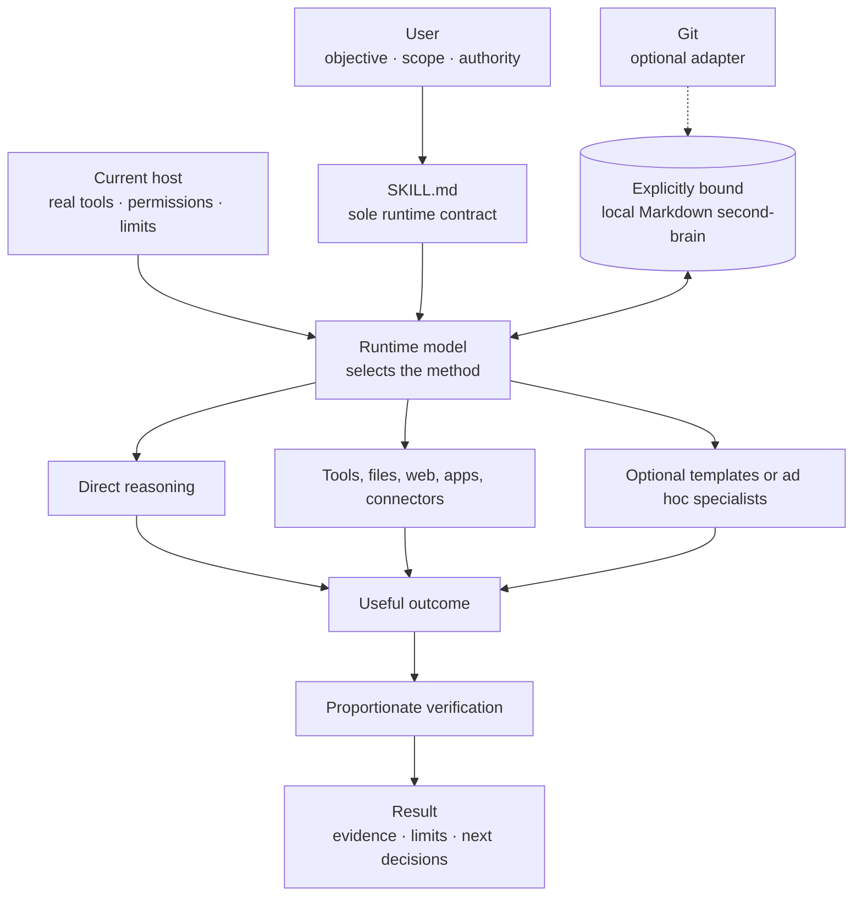

# Life OS

### A model-sovereign personal operating system with user-owned Markdown memory

[English](README.md) · [中文](i18n/zh/README.md) · [日本語](i18n/ja/README.md)

> **Life OS gives the model freedom over how to work—not freedom over what it
> may do.**

Life OS is a portable Markdown operating contract for AI-assisted decisions,
planning, reflection, research, execution, and durable personal knowledge. The
user defines the objective, scope, data boundary, and consequential actions.
The runtime model chooses the most useful method for the actual task.

That method may be a direct answer, focused questions, file work, web research,
an application or connector, one specialist perspective, several independent
perspectives, or no tool at all. When persistent context is wanted, Life OS
works with one explicitly approved local Markdown directory. Git is optional.

The repository-root [`SKILL.md`](SKILL.md) is the **sole universal runtime
authority**. This README explains the product; it does not add another runtime
contract.

[Why Life OS?](#why-life-os) ·
[How it works](#how-life-os-works) ·
[Mechanisms](#mechanisms-and-why-they-exist) ·
[Use cases](#what-you-can-use-it-for) ·
[Agent templates](#the-24-optional-agent-templates) ·
[Get started](#get-started)

## Life OS in one minute

1. **You state the outcome and boundary.** Say what you want, which material is
   in scope, and which external actions are or are not authorized.
2. **`SKILL.md` supplies the product contract.** It defines authority,
   persistence, privacy, risk, and completion semantics.
3. **The model chooses the method.** It can work directly, use available tools,
   or bring in optional perspectives when they materially improve the result.
4. **Persistent memory is explicitly bound.** Full Mode uses a local Markdown
   directory that you selected. Without one, Life OS remains useful in
   Conversation-Only Mode.
5. **Evidence matches the claim.** A small answer needs less verification than
   a migration, public action, financial recommendation, or release.
6. **You retain control.** Saving locally does not silently become committing,
   pushing, publishing, sending, deleting, purchasing, or migrating.

## Why Life OS?

An AI assistant can be highly capable and still become less useful over time.
The problem is often not model intelligence. It is the absence of a durable,
understandable operating relationship between the user, the model, the user's
knowledge, and the tools that can change the world.

| Common problem | Life OS response | Why it matters |
|---|---|---|
| Every conversation starts cold | An explicitly bound local Markdown second-brain can preserve relevant decisions, projects, knowledge, and context | Work can compound across sessions without making one chat transcript the source of truth |
| A framework forces every request through the same agent chain | The runtime model selects zero, one, or multiple perspectives according to the task | Simple work stays simple; difficult work can receive real specialization |
| “Memory” is hidden inside a provider or database | Persistent Life OS knowledge is readable, editable Markdown owned by the user | The data remains inspectable and useful outside one model or application |
| Tool access is confused with permission | Scope and consequential actions remain under user authority | A capable model can act decisively without inventing authorization |
| “Done” means the model says it is done | Verification is proportional to risk and tied to observable evidence | Completion claims become more trustworthy |
| A product works only in one AI host | Host adapters describe capabilities and honest fallbacks without changing product semantics | The same core contract can travel across capable hosts |
| Personal systems grow into process bureaucracy | Commands, stages, agents, and schemas are optional methods—not universal rituals | Structure serves the outcome instead of becoming the outcome |

Life OS is especially useful when you want an AI relationship that becomes more
context-aware without surrendering data ownership, or when you want a strong
model to exercise judgment without being trapped inside a predetermined
workflow.

## What Life OS is—and is not

| Life OS is | Life OS is not |
|---|---|
| A portable set of Markdown instructions, templates, references, and conformance scenarios | A new foundation model |
| A contract for model autonomy inside user-controlled boundaries | Permission for unrestricted autonomy |
| A way to use local Markdown as durable personal context | A mandatory database, cloud account, or proprietary vault |
| A host-agnostic product layer | A promise that every host exposes the same tools |
| A collection of optional analytical perspectives | A required simulated government, company, or fixed multi-agent organization |
| A framework for evidence-based completion | A guarantee that AI output is correct |
| Useful in both persistent and conversation-only operation | A replacement for qualified medical, legal, financial, or other professional judgment |

Life OS does not require you to adopt a prescribed folder tree, remember slash
commands, install agent wrappers, run a daemon, enable CI, or use Git. A host
may offer those capabilities, and the model may use them when they help, but
none is a hidden prerequisite for ordinary Life OS behavior.

## Seven design commitments

1. **User authority over purpose and consequences**
   The user owns the objective, scope, data boundary, and consequential
   external actions.

2. **Model sovereignty over method**
   The model can select tools, context, decomposition, perspectives,
   verification depth, and presentation according to the real task.

3. **One universal runtime authority**
   `SKILL.md` governs. Hosts, templates, references, docs, and historical files
   cannot quietly introduce a second mandatory workflow.

4. **User-owned, Markdown-first persistence**
   Persistent knowledge stays understandable and editable without requiring a
   particular model, database, or cloud service.

5. **Explicit workspace binding**
   Life OS does not search for, guess, or silently adopt a second-brain.

6. **Proportional structure and verification**
   The amount of orchestration and evidence should match the task—not a ritual.

7. **Honest capability adaptation**
   Missing tools lead to a fallback or a stated limitation, never a fabricated
   success or simulated guarantee.

## How Life OS works

This diagram is a mental model, not a fixed pipeline. A simple request may move
straight from the user to a direct answer. A high-impact migration may require
context inspection, a preservation plan, multiple checks, and an explicit
report of unresolved risk.

### A typical interaction

1. The model identifies the actual objective and the already-authorized scope.
2. It asks a question only if ambiguity could materially change the result,
   target, cost, or risk.
3. It chooses the smallest useful method.
4. It loads only the context needed for the current objective.
5. It acts inside scope, using the capabilities the host truly provides.
6. It verifies strongly enough to support the completion claim.
7. It reports the result and persists it only when persistence was requested
   and an appropriate binding exists.

No step count or sequence is universally mandatory. The outcome and boundaries
are mandatory; the route is not.

### Natural language is the interface

Life OS interprets ordinary language according to the current objective and
scope. These words express intent; they are not hard-coded workflow macros.

| What the user says | Typical meaning | What it does not imply |
|---|---|---|
| **Start / begin** | Understand the objective and use an existing explicit binding if relevant | A mandatory briefing, pull, or agent launch |
| **Review** | Inspect the requested material and return evidence-based findings | A fixed review committee or score |
| **Plan** | Add only the structure useful for the objective | A required project system or permanent record |
| **Remember / save** | Persist the requested material inside an appropriate writable binding | Commit, push, cloud sync, or saving every inference |
| **Update** | Change the identified in-scope artifact | Bulk migration or unrelated modernization |
| **End / done** | Summarize or stop | Archive, commit, push, publish, or delete |
| **Check Life OS** | Inspect the authorized setup and report directory type, binding, mode, and Git separately | Searching other directories or making repairs without a repair request |

Legacy commands or theme-specific trigger words may still be understood as
intent. They do not reactivate their retired fixed pipelines.

## Model sovereignty

“Model sovereignty” means the model is trusted to exercise judgment about
method. It does **not** mean that the model becomes the owner of the user's
goals, identity, files, accounts, or decisions.

| The model may decide | The user or platform still decides |
|---|---|
| Whether to answer directly or inspect more context | What outcome is wanted |
| Whether a tool would improve the result | Which workspace and data are in scope |
| Whether zero, one, or multiple specialists are useful | Whether sensitive data may be accessed |
| Whether work should be sequential or parallel | Whether an external action is authorized |
| How deeply to verify a claim | Whether to accept a consequential recommendation |
| How to structure and explain the result | Platform permissions and safety requirements |

### Dynamic orchestration

Life OS asks the model to use the **smallest amount of orchestration that
materially improves the result**.

| Situation | A proportionate response might be |
|---|---|
| “Rewrite this sentence” | Direct answer, no tools, no agent |
| “Compare these two plans” | Direct comparison or one focused planning perspective |
| “Audit this release” | Repository inspection plus an independent reviewer or auditor if useful |
| “Choose between relocating and staying” | Several genuinely different perspectives, visible assumptions, and scenario comparison |
| “Migrate my knowledge base” | Exact target resolution, preview, preservation evidence, scoped changes, and post-change verification |

The model may reuse a template under `agents/`, combine templates, or create an
ad hoc specialist. It should not spawn an agent merely because a matching file
exists, and it must not claim process isolation that the host cannot provide.

## Operating modes and persistent memory

### Full Mode and Conversation-Only Mode

| | Full Mode | Conversation-Only Mode |
|---|---|---|
| Local Markdown second-brain | One user-approved directory is explicitly bound | No directory is bound |
| Read persistent context | Yes, within the binding and current task scope | Only context supplied in the conversation |
| Write durable records | Yes, when write access and the request authorize it | No |
| Cross-session persistence claim | Supported through the bound Markdown data | Not claimed |
| Git required | No | No |
| Useful analysis, planning, and research | Yes | Yes |

Conversation-Only Mode is not a broken installation. It is an honest,
non-persistent mode for users who want help without binding local data.

### What counts as a binding?

A valid binding identifies:

- the exact local directory selected by the user;
- whether access is read-only or read/write;
- whether approval is for this session or has been intentionally remembered by
  the host;
- a current host capability that can actually address the directory.

Life OS never infers a binding from `.git`, a familiar folder name, `SOUL.md`,
filesystem proximity, a previously visible window, or a development repository.
If a previously approved target becomes unavailable, the model reports that
state instead of silently selecting another directory.

### What can the Markdown second-brain contain?

Life OS adapts to existing user structures. Common, optional concepts include:

| Record type | What it can preserve |
|---|---|
| Decisions | Outcome, rationale, assumptions, alternatives, reopen conditions |
| Tasks | Status, priority, due date, owner, related project |
| Projects | Desired outcome, milestones, constraints, current state |
| Areas | Ongoing responsibilities such as health, finance, relationships, or learning |
| Journals and reviews | Events, reflections, progress, setbacks, and lessons |
| Wiki notes | Reusable knowledge with provenance and links |
| Identity and values | User-authored principles, boundaries, and longer-term direction |
| Methods | Reusable ways of working and the conditions where they help |
| Strategic relationships | Dependencies and second-order effects across goals or projects |

These are capabilities, not a mandatory schema. An established second-brain's
organization takes precedence. Life OS creates only what the requested outcome
needs and does not silently normalize the whole directory.

### The persistence cycle

When persistent context is relevant, the model may:

1. retrieve a small set of relevant records;
2. distinguish current facts, past interpretations, and superseded decisions;
3. use that context in the present task;
4. save or update a durable record when the user asks;
5. preserve existing structure and unrelated content;
6. report exact writes and unresolved conflicts.

It should not turn every conversation into permanent memory, persist sensitive
inferences without user intent, or load unrelated personal data “just in case.”

### Git is an adapter, not the memory

Git can provide useful history, diffs, synchronization, and recovery evidence.
It remains separate from local Markdown persistence.

| Local request | Does it imply Git? |
|---|---|
| “Remember this decision” | No |
| “Save this plan in the bound project” | No |
| “End the session” | No |
| “Commit these exact changes” | Yes, for that exact scoped commit |
| “Push this branch to origin” | Yes, for that exact remote action |

A second-brain without Git can still support Full Mode. A Git repository that
was never bound is not a second-brain.

### Concurrent work, conflicts, and migrations

Life OS does not require one locking technology, but it does require a safe
outcome:

- inspect current content before overwriting a shared record;
- do not silently lose concurrent work;
- merge a conflict when the correct result is clear;
- surface material ambiguity instead of guessing;
- do not present temporary or conflict artifacts as completed user records.

Depending on the host and target, the model may use atomic writes, file
metadata, compare-and-swap behavior, Git, or another available method. A
structural migration is a separate, explicit operation: identify the exact
target, preview material changes, preserve user-authored content, select useful
recovery evidence, and verify the result. Git may help but is not required.

## Mechanisms and why they exist

| Mechanism | What it does | Why it exists |
|---|---|---|
| Sole authority | Makes `SKILL.md` the final Life OS product contract | Prevents drift between hosts, templates, commands, and historical docs |
| Intent-based authorization | Treats a clear, scoped request as authority for normal in-scope work | Avoids repetitive confirmation while preserving user control |
| Workspace boundary | Limits inspection and changes to explicitly selected scope | File access should not become permission to inspect a person's whole digital life |
| Model sovereignty | Lets the model choose method, tools, roles, and depth | A capable model should adapt to the problem instead of performing a ceremony |
| Dynamic orchestration | Uses zero, one, or multiple perspectives as needed | Independent thinking is valuable only when it adds more than coordination cost |
| Open roles | Allows existing templates to be skipped, combined, or replaced | New problems should not be forced into a closed organization chart |
| Natural-language operation | Interprets ordinary requests such as plan, review, remember, or end | Users should not need to memorize control syntax |
| Explicit second-brain binding | Connects persistence to one approved local Markdown directory | Durable personal context needs a clear ownership and privacy boundary |
| Conversation-only fallback | Keeps Life OS useful without persistent storage | Not every conversation needs or should create memory |
| Markdown-first knowledge | Stores durable user context in portable text | Knowledge remains inspectable, editable, linkable, and tool-independent |
| Optional Git adapter | Adds history and synchronization when requested | Version control is useful but should not determine product readiness |
| Context minimization | Loads only what is relevant to the current objective | Reduces privacy exposure, distraction, and unnecessary token use |
| Risk-sensitive judgment | Raises evidence and caution for higher-impact work | The cost of being wrong varies dramatically by domain |
| Dynamic verification | Matches checks to the claim and impact | A one-line edit and a public release should not require the same evidence |
| Host adaptation | Uses real host capabilities and honest fallbacks | Shell, apps, connectors, and subagents differ across environments |
| Optional themes | Changes language and presentation without changing semantics | Users can choose a culturally comfortable interface without changing safety |
| Completion standard | Separates observed, changed, verified, unavailable, and blocked state | “Done” should describe reality, not confidence or intention |
| Historical boundary | Keeps superseded designs under `docs/history/` | Provenance remains available without reviving obsolete requirements |

## What you can use it for

Life OS is not limited to “life planning.” It can support personal and
professional work wherever context, judgment, action, or learning must remain
connected.

| Use case | What Life OS can contribute | Example request |
|---|---|---|
| Major decision | Alternatives, assumptions, trade-offs, scenarios, reversible experiments | “Compare staying, relocating, and delaying for six months. Show which assumptions control the answer.” |
| Weekly priorities | A small set of high-leverage outcomes and realistic next actions | “Help me choose the three outcomes that matter this week.” |
| Project planning | Dependencies, milestones, owners, risks, and completion evidence | “Turn this objective into a plan, but do not add project machinery that is not useful.” |
| Research | Source-grounded findings, contradictions, uncertainty, and synthesis | “Research this question using current primary sources and separate evidence from inference.” |
| Writing and communication | Audience-aware structure, drafts, stakeholder impact, and review | “Draft this proposal, then challenge the claims that a skeptical reader would question.” |
| Reflection and retrospectives | Patterns grounded in a defined period or evidence set | “Review these four weekly notes and identify only patterns supported more than once.” |
| Knowledge extraction | Reusable concepts, methods, summaries, and linked notes | “Extract durable lessons from these documents and propose what is worth saving.” |
| Values alignment | Compare choices with user-authored values without defining the user's identity | “Show where this option supports or conflicts with the values I provided.” |
| Financial reasoning | Assumptions, cash flow, downside, liquidity, and sensitivity | “Compare these options under base and downside cases; do not present this as regulated advice.” |
| Health and resilience | Capacity, routines, environment, uncertainty, and qualified escalation | “Help me design a sustainable routine and identify what needs professional input.” |
| Monitoring | Recheck an explicit condition until a deadline when the host supports it | “Watch this PR until checks finish, then report the terminal state.” |
| Auditing completion | Compare a claim with files, tests, remote state, or other independent evidence | “Verify whether this release is actually published, not merely tagged locally.” |

The model can answer directly when a table, agent, file, or persistent record
would not improve the result.

## The 24 optional agent templates

The files under [`agents/`](agents/) are reusable perspectives, not employees
that must be launched and not a closed registry. Every template inherits the
same user scope, privacy boundary, and completion standard as the parent model.

### Direction and decision quality

| Template | Useful contribution |
|---|---|
| **Router** | Clarifies the real objective and chooses a proportionate path when the request is materially ambiguous |
| **Planner** | Turns an objective into a practical, verifiable plan when dependencies and sequencing matter |
| **Reviewer** | Challenges assumptions, unsupported claims, scope leaks, and weak trade-offs |
| **Council** | Preserves and compares genuinely conflicting credible perspectives |
| **Strategist** | Examines long-horizon direction, optionality, path dependence, and second-order effects |
| **Advisor** | Connects a decision to grounded longer-term patterns and practical counsel |
| **Values Check** | Compares a choice with user-authored values and identity without claiming authority over them |

### Six life and work domains

| Template | Useful contribution |
|---|---|
| **People** | Relationships, stakeholders, communication, incentives, trust, and boundaries |
| **Finance** | Cash flow, assets, assumptions, liquidity, opportunity cost, and downside |
| **Growth** | Learning, skill, expression, feedback loops, and compounding development |
| **Execution** | Priorities, sequencing, ownership, bottlenecks, action, and completion |
| **Governance** | Rights, rules, obligations, authorization, accountability, privacy, and control |
| **Infrastructure** | Health, environment, tools, capacity, reliability, maintenance, and recovery |

### Context, knowledge, and evidence

| Template | Useful contribution |
|---|---|
| **Hippocampus** | Retrieves a small set of relevant prior records from an explicitly bound second-brain |
| **Concept Lookup** | Finds relevant concepts and relationships with provenance and confidence |
| **Knowledge Extractor** | Turns source material into reusable, provenance-aware knowledge |
| **Context Arbitrator** | Ranks and synthesizes independent signals without erasing disagreement |
| **Auditor** | Compares claims and changes with independent evidence |
| **Narrator** | Converts verified material into a coherent report, briefing, or account |

### Delivery, review, and persistence

| Template | Useful contribution |
|---|---|
| **Dispatcher** | Divides safely separable work into clear assignments with target ownership |
| **Retrospective** | Reviews a defined period or body of work for evidence-backed lessons |
| **Monitor** | Observes an explicit condition over a bounded period using real host capabilities |
| **Archiver** | Persists requested material into an explicitly bound writable second-brain |
| **Memory Keeper** | Repairs links, reconciles records, or previews a scoped migration when requested |

Skip every template when direct work is sufficient. A narrow, one-time need is
often better served by an ad hoc specialist than by adding another permanent
file.

## Nine optional presentation themes

Themes change display names, language, tone, and headings. They do not create
real offices, approval power, vetoes, mandatory stages, or different safety
rules.

| Language | Theme | Presentation style |
|---|---|---|
| English | Roman Republic | Classical civic vocabulary with restrained gravitas |
| English | US Government | Concise public-policy briefing language |
| English | C-Suite | Direct, modern business language |
| 中文 | 三省六部 | 现代中文配合历史治理隐喻 |
| 中文 | 现代政府 | 简洁、有条理的政策语言 |
| 中文 | 公司部门 | 专业、直接、结果导向的职场语言 |
| 日本語 | 明治政府 | 明快な現代語と歴史的な語彙 |
| 日本語 | 霞が関 | 簡潔な政策ブリーフ調 |
| 日本語 | 企業 | 明確で簡潔なビジネス日本語 |

Theme selection is optional. If no theme is selected, the model should continue
naturally in the user's language instead of blocking useful work.

## Host adaptation

Life OS currently includes non-authoritative adapters for
[Claude](hosts/CLAUDE.md), [Gemini](hosts/GEMINI.md), and
[Codex](hosts/AGENTS.md). They describe possible capabilities, not separate
products.

| Capability | If available | If unavailable |
|---|---|---|
| Local filesystem | Read or edit authorized Markdown | Work with conversation-supplied context |
| Shell or CLI | Use when it is the best in-scope method | Use host-native alternatives or continue without it |
| Browser or connectors | Research or act on authorized external systems | State the limitation or use supplied sources |
| Subagents | Delegate safely separable work when independence helps | Work directly in the current model |
| Scheduled or recurring observation | Monitor a bounded condition | Offer a manual recheck or state that recurrence is unavailable |
| Host approval prompt | Respect the platform's permission boundary | Do not invent an extra Life OS ritual |

The host must not pretend to provide isolation, background execution, tool
evidence, or durable persistence that it does not actually provide.

## Authorization, privacy, and risk

### Intent-based authorization

Life OS aims for decisive work without repetitive permission theater.

| Situation | Expected behavior |
|---|---|
| Relevant read-only inspection inside the selected scope | Proceed |
| A clear, reversible in-scope change included in the request | Proceed |
| A clear save/update request inside a writable binding | Perform the scoped local write |
| Exact commit, push, publish, send, delete, purchase, or migration requested for an unambiguous target | Treat that exact request as authorization |
| Target, recipient, cost, data boundary, or destructive impact is materially ambiguous | Ask before acting |
| A consequential action would expand beyond the request | Ask before expanding scope |
| The user says “done,” “end,” or “adjourn” | Summarize or stop; do not infer side effects |

### Privacy and context minimization

- Read enough context to ground the result, not every accessible file.
- Respect every excluded path, person, project, and topic.
- Give a specialist only the context useful for its assignment.
- Do not expose private local content to an external service merely because it
  is readable.
- Keep secrets, credentials, and sensitive personal material out of logs and
  external artifacts.
- Do not silently persist inferred health, identity, relationship, or
  behavioral conclusions.

Life OS is a Markdown instruction package, not a sandbox or encryption product.
Actual data exposure also depends on the selected host, model provider, tools,
connectors, and operating environment. Users should evaluate those systems
separately.

### Risk-sensitive judgment

Extra care is appropriate for health, mental health, legal rights, finance,
physical safety, children, privacy, credentials, public claims, publication,
irreversible changes, and substantial cost.

Depending on the actual risk, the model may seek fresher primary evidence,
show assumptions and uncertainty, compare downside scenarios, narrow a
recommendation, suggest qualified professional help, or pause for missing
authority. A risk label does not automatically require a fixed agent chain.

## Verification and completion

Life OS does not prescribe one universal validator. It asks for evidence strong
enough to support the exact claim being made.

| Work | Proportionate evidence might include |
|---|---|
| Explanation | Inspecting the governing source and stating uncertainty |
| Local documentation edit | Diff review, link checks, frontmatter and whitespace inspection |
| Code change | Focused tests, build or static checks appropriate to the affected behavior |
| External mutation | Reading the external system after the action and confirming changed state |
| Data migration | Exact scope, preview, preservation or recovery evidence, conflict handling, and post-change checks |
| Release | Current branch/commit identity, documentation consistency, relevant checks, remote tag, and published release state |

When material, the final report distinguishes:

- what was observed;
- what changed;
- what was verified;
- what was not verified;
- what remains blocked or unavailable.

A generated report, a green-looking label, a local commit, or the model's own
confidence is not enough when the claim concerns external or consequential
state.

## Get started

### 1. Make `SKILL.md` available to your AI host

Your host can register the repository as a local skill, copy the Markdown
package into its skill location, or work from a checkout and explicitly read
the root `SKILL.md`.

The product does not require a universal installer. Host registration is setup
plumbing, not runtime authority.

### 2. Check the current mode

Ask:

> Check whether Life OS is available in this current workspace. Do not inspect
> any other directory and do not make repairs.

A useful answer separates:

- the current directory type;
- Life OS skill availability;
- second-brain binding state;
- Full Mode versus Conversation-Only Mode;
- Git availability, reported independently.

This is the natural-language **Doctor** capability. It is read-only unless the
user asks for a repair, and it must not search unrelated directories for a
second-brain.

### 3. Start without persistent memory

> Help me decide what to prioritize this week. Ask only questions that could
> materially change the recommendation. Use only the context in this
> conversation.

No theme, command, second-brain, Git repository, or agent launch is required.

### 4. Enable Full Mode when you want persistence

Select a local Markdown directory yourself, then say:

> Bind the local directory I selected as my read/write Life OS second-brain for
> this session. Review the project note I name, help me decide the next move,
> and save the agreed decision beside that project.

This authorizes the described local read/write work. It does not authorize a
commit, push, publication, or bulk migration.

### More useful prompts

> Compare these three options. Show assumptions, downside, and what evidence
> would change the recommendation.

> Review this project for the smallest high-leverage next action. Do not create
> a large planning process.

> Extract reusable knowledge from these sources. Preserve provenance and ask
> before saving anything sensitive.

> Audit whether this task is actually complete. Distinguish local evidence,
> remote state, and anything you could not verify.

> Save this decision in the bound second-brain, following the existing local
> structure. Do not use Git.

## Compatibility and migration

- Existing v1.9 and v1.10 Markdown remains readable.
- Existing directory names and frontmatter do not need automatic
  normalization.
- Legacy trigger phrases may still be understood as natural-language intent.
- Git-backed second-brains continue to work, but Git is no longer a
  prerequisite.
- Retired commands and fixed workflows remain under `docs/history/` for
  provenance only.
- A structural migration requires a clear request, exact target, preview,
  preservation evidence, and post-change verification.

Read [`MIGRATION.md`](MIGRATION.md) before requesting a structural migration.

## Repository map

| Path | Purpose |
|---|---|
| [`SKILL.md`](SKILL.md) | Sole universal runtime contract |
| [`AGENTS.md`](AGENTS.md) | Contributor guidance for this source repository |
| [`hosts/`](hosts/) | Non-authoritative host capability adapters |
| [`agents/`](agents/) | 24 optional reusable perspectives |
| [`themes/`](themes/) | 9 optional presentation adapters |
| [`references/`](references/) | Non-authoritative data shapes and operating references |
| [`evals/`](evals/) | Observable behavioral conformance scenarios |
| [`docs/`](docs/) | Current guides and documentation |
| [`docs/history/`](docs/history/) | Superseded architecture and release evidence |
| [`i18n/zh/`](i18n/zh/) | Current Chinese entry documentation |
| [`i18n/ja/`](i18n/ja/) | Current Japanese entry documentation |

Useful next pages:

- [Documentation index](docs/index.md)
- [Installation](docs/installation.md)
- [Quickstart](docs/getting-started/quickstart.md)
- [First session](docs/getting-started/first-session.md)
- [Second-brain concepts](docs/second-brain.md)
- [Agents and hosts](docs/reference/agents-and-hosts.md)
- [Intent and authorization](docs/user-guide/making-decisions/intent-and-authorization.md)
- [v1.11 migration guide](MIGRATION.md)
- [Changelog](CHANGELOG.md)

## Frequently asked questions

### Do I need Git?

No. Git can add history, comparison, synchronization, and recovery evidence,
but a valid local Markdown binding works without it.

### Do I need a second-brain?

Only for durable Full Mode. Analysis, planning, research, and direct assistance
remain available in Conversation-Only Mode.

### Will Life OS automatically find or read my personal files?

No. A second-brain must be explicitly bound. Accessible files, nearby paths,
Git configuration, or prior screen context do not constitute authorization.

### Does “remember this” authorize a write?

When a writable second-brain is already bound and the target is clear, a direct
request to remember, save, track, or update authorizes the corresponding scoped
local persistence. It does not authorize remote synchronization.

### Does Life OS always use multiple agents?

No. Direct work is preferred when it is sufficient. Multiple perspectives are
useful only when independence or specialization materially improves the result.

### Can the model use Shell, CLI, browsers, or applications?

Yes, when the current host exposes them, they are useful, and the action stays
inside authorized scope. None is universally required.

### Are the themes different operating systems?

No. Themes are presentation adapters. They change vocabulary and tone, not
authority, persistence, safety, or orchestration.

### Which AI model is required?

Life OS is model- and host-agnostic. More capable models and richer host tools
may handle complex work better, but the product contract does not bind itself
to one vendor or model ID.

### Is Life OS autonomous?

It grants autonomy over **method**, not over **authorization**. The model may
choose how to pursue the user's objective; it may not invent permission for
consequential actions or unrelated data.

### Is Markdown the only thing the model may create?

No. Life OS itself is distributed as portable Markdown. The model may create
code, documents, images, or other artifacts when the user's actual project
requires them. Executable automation simply cannot become a hidden prerequisite
for ordinary Life OS operation.

### Can Life OS replace a doctor, lawyer, financial adviser, or therapist?

No. It can organize information, surface assumptions, compare options, and
identify when qualified help is appropriate. It does not impersonate
professional or human authority.

### How do I know a task is really complete?

Ask for evidence appropriate to the claim. For consequential work, the result
should distinguish observed state, changes made, checks performed, unavailable
checks, and remaining decisions.

## Version and license

This README describes Life OS **v1.11.0**.

Life OS is licensed under the [Apache License 2.0](LICENSE). See the
[changelog](CHANGELOG.md) for release history and
[`docs/history/`](docs/history/) for superseded designs.
