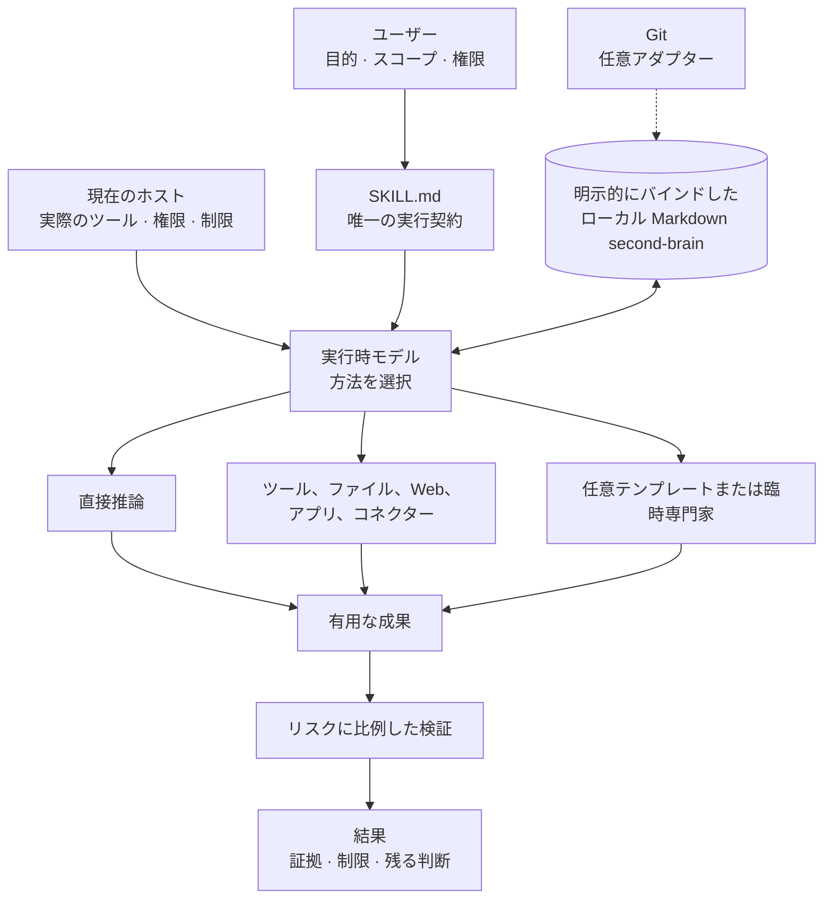

> [!IMPORTANT]
> **プロジェクトの現状：開発を一時停止**
>
> 私たちは長期間にわたり Life OS の開発に取り組んできました。また、これまで
> 本プロジェクトに関心を寄せ、ご利用くださった皆さまに心より感謝いたします。
> 率直に申し上げると、継続的な開発と慎重な比較を重ねた結果、Life OS は現時点
> において、市場にある優れた同種製品の完成度や利用体験にはまだ及ばないと判断
> しました。そのため、本プロジェクトの今後の開発を当面の間休止することに
> いたしました。
>
> 引き続き同様の Agent 機能をご利用になりたい方には、Nous Research が開発する
> **Hermes Agent** をお勧めします。
>
> - 公式サイト：
>   [https://hermes-agent.nousresearch.com/](https://hermes-agent.nousresearch.com/)
> - GitHub リポジトリ：
>   [https://github.com/NousResearch/hermes-agent](https://github.com/NousResearch/hermes-agent)
>
> 本リポジトリの既存コンテンツは削除せず、今後も参照できる状態で残します。

# Life OS

### モデルが手段を選び、ユーザー所有の Markdown に記憶を残すパーソナル OS

[English](../../README.md) · [中文](../zh/README.md) · [日本語](README.md)

> **Life OS がモデルに与えるのは「どう進めるか」の自由であり、「何をしても
> よい」という無制限の権限ではありません。**

Life OS は、AI を使った意思決定、計画、振り返り、調査、実行、長期的な個人
知識のための、持ち運び可能な Markdown の運用契約です。ユーザーが目的、
スコープ、データ境界、重大な外部操作を決め、実行時モデルが実際の課題に合う
方法を選びます。

方法は、直接回答、少数の重要な確認、ファイル作業、Web 調査、アプリや
コネクターの利用、一つの専門的視点、複数の独立した視点、あるいはツールを
使わない作業のいずれでもかまいません。継続的な文脈が必要な場合は、ユーザー
が明示的に承認したローカル Markdown ディレクトリを一つ使用します。Git は
任意です。

リポジトリ直下の [`SKILL.md`](../../SKILL.md) が、**唯一の共通ランタイム
権威**です。この README は製品を説明するものであり、第二の運用契約を追加
するものではありません。

[なぜ Life OS なのか](#why-life-os) ·
[仕組み](#how-life-os-works) ·
[全メカニズム](#mechanisms-and-why-they-exist) ·
[利用例](#what-you-can-use-it-for) ·
[Agent テンプレート](#the-24-optional-agent-templates) ·
[始め方](#get-started)

## 1 分でわかる Life OS

1. **望む結果と境界を伝える。** 何を達成したいか、どの資料が対象か、どの
   外部操作を許可するか、または許可しないかを示します。
2. **`SKILL.md` が製品契約を提供する。** 権威、永続化、プライバシー、
   リスク、完了の意味を定義します。
3. **モデルが方法を選ぶ。** 直接作業することも、利用可能なツールを使う
   ことも、結果を実質的に改善する場合だけ専門的視点を加えることもできます。
4. **永続記憶は明示的にバインドする。** Full Mode ではユーザーが選んだ
   ローカル Markdown ディレクトリを使います。未バインドでも
   Conversation-Only Mode で利用できます。
5. **主張に見合う証拠を使う。** 短い説明と、データ移行、公開操作、財務上の
   推奨、正式なリリースでは、必要な検証強度が異なります。
6. **支配権はユーザーに残る。** ローカル保存が、自動的に commit、push、
   公開、送信、削除、購入、移行へ広がることはありません。

## なぜ Life OS なのか

AI アシスタントは高性能でも、時間とともに役に立たなくなることがあります。
原因はモデルの知能ではなく、ユーザー、モデル、個人知識、現実を変更できる
ツールの間に、持続的で理解可能な協働関係がないことです。

| よくある問題 | Life OS の対応 | なぜ重要か |
|---|---|---|
| 会話のたびにゼロから始まる | 明示的にバインドしたローカル Markdown second-brain に、関連する決定、プロジェクト、知識、文脈を残せる | 一つのチャット履歴を唯一の事実源にせず、作業をセッション間で積み上げられる |
| すべての依頼が同じ agent チェーンを通る | 実行時モデルが、課題に応じてゼロ、一つ、複数の視点を選ぶ | 単純な仕事は単純なまま、難しい仕事には本当の専門性を加えられる |
| 「記憶」がプロバイダーやデータベースの中に隠れる | 永続的な Life OS 知識は、ユーザーが所有する読み書き可能な Markdown | 一つのモデルやアプリを離れてもデータを理解し、利用できる |
| ツールへアクセスできることが、実行許可と混同される | スコープと重大な外部操作はユーザー権限のまま | モデルは決断力を持てるが、権限を作り出せない |
| 「完了」がモデルの自己申告になる | リスクに比例した、観察可能な証拠を要求する | 完了報告の信頼性が上がる |
| 一つの AI ホストでしか動かない | ホストアダプターが実能力と正直なフォールバックを説明する | 同じ中核契約を複数の有能なホストへ持ち運べる |
| 個人システムが手続きの官僚制になる | コマンド、段階、agent、schema は任意の手段であり、普遍的な儀式ではない | 構造が成果に奉仕し、成果の代わりにならない |

データ所有権を手放さずに AI との関係を文脈豊かにしたい場合、または強力な
モデルの判断力を活かしつつ、決め打ちのワークフローに閉じ込めたくない場合に、
Life OS は特に有用です。

## Life OS であるもの、ないもの

| Life OS であるもの | Life OS ではないもの |
|---|---|
| Markdown の指示、テンプレート、参照資料、適合シナリオからなる持ち運び可能なパッケージ | 新しい基盤モデル |
| ユーザー管理の境界内でモデルに方法選択を任せる契約 | 無制限の自律権限 |
| ローカル Markdown を長期的な個人文脈として使う方法 | 必須のデータベース、クラウドアカウント、専用 vault |
| ホストに依存しない製品レイヤー | すべてのホストが同じツールを持つという約束 |
| 任意に利用できる分析視点の集合 | 必須の模擬政府、企業、固定 multi-agent 組織 |
| 証拠に基づいて完了を判断する枠組み | AI 出力の正しさを保証するもの |
| 永続モードと会話限定モードの両方で使える仕組み | 医療、法律、財務その他の専門家の代替 |

Life OS は、所定のフォルダ構成、スラッシュコマンドの暗記、agent wrapper の
インストール、daemon、CI、Git を要求しません。ホストがそれらを提供し、
モデルが有用と判断すれば使えますが、通常動作の隠れた前提にはなりません。

## 七つの設計上の約束

1. **目的と結果に対するユーザー権限**
   目的、スコープ、データ境界、重大な外部操作はユーザーが所有します。

2. **方法に対するモデル主権**
   モデルは課題に応じて、ツール、文脈、分解、視点、検証深度、表現方法を
   選べます。

3. **共通ランタイム権威は一つだけ**
   `SKILL.md` が最終的に支配します。ホスト、テンプレート、参照資料、文書、
   履歴ファイルが、別の必須ワークフローを密かに追加することはできません。

4. **ユーザー所有・Markdown 優先の永続化**
   長期知識は、特定のモデル、データベース、クラウドサービスがなくても理解・
   編集できます。

5. **明示的なワークスペース・バインディング**
   Life OS は second-brain を検索、推測、無断採用しません。

6. **構造も検証も必要な分だけ**
   オーケストレーションと証拠の量は、儀式ではなく課題に合わせます。

7. **ホスト能力への正直な適応**
   ツールがなければ代替手段か制限を示し、成功や保証を捏造しません。

## Life OS の仕組み

この図は理解のためのモデルであり、固定パイプラインではありません。単純な
依頼ならユーザーから直接回答へ進めます。影響の大きい移行なら、文脈の確認、
保全計画、複数の検証、残存リスクの明示が必要になる場合があります。

### 典型的なやり取り

1. モデルが実際の目的と、すでに許可されたスコープを把握する。
2. 曖昧さが結果、対象、費用、リスクを実質的に変える場合だけ質問する。
3. 十分に役立つ最小の方法を選ぶ。
4. 現在の目的に必要な文脈だけを読み込む。
5. スコープ内で、ホストが実際に持つ能力だけを使って行動する。
6. 完了主張を支えられる強さで検証する。
7. 結果を報告し、永続化が求められ、適切なバインディングがある場合だけ保存
   する。

普遍的に必須のステップ数や順序はありません。成果と境界は必須ですが、経路は
固定されません。

### 自然言語がインターフェース

Life OS は普通の言葉を、現在の目的とスコープに沿って解釈します。これらは
意図を表す言葉であり、固定ワークフローのマクロではありません。

| ユーザーの言葉 | 通常の意味 | 意味しないこと |
|---|---|---|
| **Start / 開始** | 目的を理解し、関係する場合は既存の明示的バインディングを使う | 必須ブリーフィング、pull、agent 起動 |
| **Review / レビュー** | 指定された材料を確認し、証拠に基づく発見を返す | 固定審査会やスコア |
| **Plan / 計画** | 目的に役立つ分だけ構造を加える | 必須プロジェクトシステムや永続記録 |
| **Remember / Save** | 適切な書込可能バインディングに指定内容を保存する | commit、push、cloud sync、すべての推論の保存 |
| **Update / 更新** | 特定されたスコープ内成果物を変更する | 一括移行や無関係な刷新 |
| **End / Done / 終了** | 要約または停止する | archive、commit、push、公開、削除 |
| **Check Life OS** | 許可済み環境を確認し、ディレクトリ種別、binding、mode、Git を分けて報告する | 他ディレクトリの検索や、修復依頼なしの変更 |

旧コマンドやテーマ固有のトリガー語も意図として理解できますが、退役した固定
パイプラインを再有効化するものではありません。

## モデル主権

「モデル主権」とは、**方法**についてモデルの判断を信頼することです。モデルが
ユーザーの目標、アイデンティティ、ファイル、アカウント、人生の決定を所有
するという意味ではありません。

| モデルが決められること | ユーザーまたはプラットフォームが決めること |
|---|---|
| 直接答えるか、文脈を追加で読むか | 何を達成したいか |
| ツールが結果を改善するか | どのワークスペースとデータが対象か |
| ゼロ、一つ、複数の専門視点が必要か | 機微データへのアクセスを認めるか |
| 直列か並列か | 重大な外部操作を許可するか |
| どの深さまで主張を検証するか | 重大な推奨を受け入れるか |
| 結果をどう構成し説明するか | プラットフォームの権限と安全要件 |

### 動的オーケストレーション

Life OS は、**結果を実質的に改善する最小限のオーケストレーション**を求めます。

| 状況 | 適切な対応例 |
|---|---|
| 「この一文を書き直して」 | 直接回答。ツールも agent も不要 |
| 「二つの計画を比較して」 | 直接比較、または一つの計画視点 |
| 「このリリースを監査して」 | リポジトリ確認と、必要なら独立 reviewer / auditor |
| 「移住するか残るか決めたい」 | 本当に異なる複数視点、明示した仮定、シナリオ比較 |
| 「知識ベースを移行して」 | 正確な対象、プレビュー、保全証拠、限定変更、事後検証 |

モデルは `agents/` のテンプレートを再利用、組み合わせ、または臨時専門家に
置き換えられます。同名ファイルがあるだけで agent を起動せず、ホストが提供
しないプロセス分離を主張しません。

## 動作モードと永続記憶

### Full Mode と Conversation-Only Mode

| | Full Mode | Conversation-Only Mode |
|---|---|---|
| ローカル Markdown second-brain | ユーザー承認済みの一つのディレクトリを明示的にバインド | バインドなし |
| 永続文脈の読み取り | バインディングと現在の課題スコープ内で可能 | 会話で与えられた文脈のみ |
| 永続レコードの書き込み | 書き込み権限と依頼がある場合に可能 | 不可 |
| セッションをまたぐ記憶の主張 | バインドされた Markdown が根拠 | 主張しない |
| Git | 不要 | 不要 |
| 分析、計画、調査 | 可能 | 可能 |

Conversation-Only Mode は壊れたインストールではありません。ローカルデータを
バインドしたくない場合の、正直な非永続モードです。

### 有効なバインディングとは

有効なバインディングには次が必要です。

- ユーザーが自分で選んだ正確なローカルディレクトリ；
- 読み取り専用か、読み書き可能か；
- 承認が今回のセッションだけか、ユーザーの依頼でホストに記憶されたものか；
- 現在のホストがそのディレクトリを実際に扱えること。

Life OS は `.git`、見慣れたフォルダ名、`SOUL.md`、近接するパス、以前画面に
見えた場所、開発リポジトリからバインディングを推測しません。承認済み対象が
利用不能なら、別の場所を勝手に選ばず、その状態を報告します。

### Markdown second-brain に保存できるもの

Life OS は既存のユーザー構造に合わせます。一般的ですが任意の概念は次の
とおりです。

| レコード種別 | 保存できる内容 |
|---|---|
| 意思決定 | 結果、理由、仮定、代替案、再検討条件 |
| タスク | 状態、優先度、期限、担当、関連プロジェクト |
| プロジェクト | 目標成果、マイルストーン、制約、現在状態 |
| エリア | 健康、財務、関係、学習など継続的な責任 |
| ジャーナルと振り返り | 出来事、内省、進捗、失敗、学び |
| Wiki ノート | 出典とリンクを持つ再利用可能な知識 |
| アイデンティティと価値観 | ユーザー自身が記した原則、境界、長期方向 |
| メソッド | 再利用できる仕事の進め方と適用条件 |
| 戦略的関係 | 目標やプロジェクト間の依存と二次的影響 |

これらは機能であり、必須 schema ではありません。既存 second-brain の構成を
優先し、依頼の成果に必要なものだけを作成します。ディレクトリ全体を勝手に
正規化しません。

### 永続化のサイクル

永続文脈が関係する場合、モデルは次のように動けます。

1. 本当に関係する少数のレコードを取得する；
2. 現在の事実、過去の解釈、置き換えられた決定を区別する；
3. 現在の課題でその文脈を使う；
4. ユーザーが求めたときに永続レコードを保存・更新する；
5. 既存構造と無関係な内容を保持する；
6. 正確な書き込みと未解決の競合を報告する。

すべての会話を永久記憶に変えたり、ユーザー意図なしに機微な推論を保存したり、
「念のため」に無関係な個人情報を読み込んだりしません。

### Git はアダプターであり、記憶そのものではない

Git は履歴、diff、同期、復旧証拠に役立ちますが、ローカル Markdown の永続化
とは別です。

| ローカル依頼 | Git 操作を意味するか |
|---|---|
| 「この決定を覚えて」 | いいえ |
| 「この計画をバインド済みプロジェクトに保存して」 | いいえ |
| 「セッションを終了して」 | いいえ |
| 「この変更を commit して」 | はい。指定された範囲の commit のみ |
| 「この branch を origin に push して」 | はい。指定された remote 操作のみ |

Git がなくても second-brain は Full Mode で利用できます。バインドされていない
Git リポジトリは second-brain ではありません。

### 並行作業、競合、移行

Life OS は一つのロック技術を必須にしませんが、安全な結果を求めます。

- 共有レコードを上書きする前に現在内容を確認する；
- 並行作業を密かに失わない；
- 正しい結果が明確なら競合を統合する；
- 重大な曖昧さは推測せずユーザーへ示す；
- 一時ファイルや競合成果物を完成済みレコードとして報告しない。

ホストと対象に応じて、atomic write、ファイル metadata、compare-and-swap、
Git、その他利用可能な方法を選べます。構造移行は別の明示操作です。正確な
対象を確認し、重大な変更をプレビューし、ユーザー記述を保全し、有用な復旧
証拠を選び、結果を検証します。Git は役立ちますが必須ではありません。

## 全メカニズムと、その存在理由

| メカニズム | 役割 | 存在理由 |
|---|---|---|
| 唯一の権威 | `SKILL.md` を最終製品契約にする | ホスト、テンプレート、コマンド、履歴文書のドリフトを防ぐ |
| 意図に基づく権限 | 明確で限定された依頼を、通常のスコープ内作業の権限とみなす | 反復確認を避けつつ、ユーザー管理を守る |
| ワークスペース境界 | 明示的に選ばれた範囲だけを確認・変更する | ファイルを読めることは、デジタル生活全体を調べる許可ではない |
| モデル主権 | 方法、ツール、役割、深度をモデルが選ぶ | 強いモデルを儀式ではなく問題に適応させる |
| 動的オーケストレーション | 必要に応じてゼロ、一つ、複数の視点を使う | 独立思考は調整コストを上回るときだけ価値がある |
| オープンな役割 | テンプレートを省略、統合、置換できる | 新しい問題を閉じた組織図に押し込まない |
| 自然言語操作 | plan、review、remember、end など普通の依頼を理解する | 制御構文を覚えなくてよい |
| 明示的 second-brain バインディング | 永続化を一つの承認済みローカル Markdown に結びつける | 長期個人文脈には明確な所有・プライバシー境界が必要 |
| Conversation-Only フォールバック | 永続保存なしでも支援を続ける | すべての会話が記憶を作るべきではない |
| Markdown 優先知識 | 永続文脈を持ち運び可能なテキストで保存する | 知識を検査、編集、リンクでき、特定ツールに依存しない |
| 任意 Git アダプター | 求められたとき履歴と同期を追加する | バージョン管理は有用でも、製品の可用性を決めるべきではない |
| 文脈の最小化 | 現在の目的に必要な情報だけを読む | プライバシー露出、雑音、不要な token を減らす |
| リスク感応判断 | 影響の大きい仕事で証拠と注意を強める | 誤りの代償は分野ごとに大きく異なる |
| 動的検証 | 検証方法を主張と影響に合わせる | 一行の修正と公開 release に同じ証拠は不要 |
| ホスト適応 | 実在する能力を使い、正直にフォールバックする | Shell、アプリ、コネクター、subagent は環境ごとに異なる |
| 任意テーマ | 表現だけを変え、意味を変えない | 文化的に自然な UI を選んでも安全性が変わらない |
| 完了基準 | 観察、変更、検証、未確認、阻害を区別する | 「完了」が自信や意図ではなく現実を表す |
| 履歴境界 | 置き換えられた設計を `docs/history/` に残す | 来歴を保ちつつ、古い要件を復活させない |

## Life OS でできること

Life OS は「人生設計」だけのものではありません。文脈、判断、行動、学習を
つなぎ続ける必要がある個人・専門業務を支援できます。

| 利用場面 | Life OS が提供できること | 依頼例 |
|---|---|---|
| 重大な意思決定 | 選択肢、仮定、トレードオフ、シナリオ、可逆実験 | 「残る、移住する、半年延期する案を比較し、結論を左右する仮定を示して。」 |
| 週間優先順位 | 少数の高レバレッジ成果と現実的な次の一手 | 「今週重要な三つの成果を選んで。」 |
| プロジェクト計画 | 依存、マイルストーン、担当、リスク、完了証拠 | 「この目標を計画にして。ただし不要な管理手続きを増やさないで。」 |
| 調査 | 出典に基づく発見、矛盾、不確実性、統合 | 「最新の一次資料で調査し、証拠と推論を分けて。」 |
| 文書とコミュニケーション | 読み手に合わせた構成、草稿、関係者影響、レビュー | 「提案書を起草し、懐疑的な読者が疑う主張も検討して。」 |
| 振り返り | 定義した期間・証拠内で裏付けのあるパターンを抽出 | 「4 週間分の記録から、複数回確認できるパターンだけ示して。」 |
| 知識抽出 | 再利用可能な概念、方法、要約、リンク | 「この資料から長期的に使える知識を抽出し、保存候補を提案して。」 |
| 価値観との整合 | ユーザー記述の価値観と比較し、アイデンティティを代決しない | 「この案が、私の示した価値観と一致・衝突する点を説明して。」 |
| 財務的検討 | 仮定、キャッシュフロー、下振れ、流動性、感応度 | 「基本・下振れケースで比較し、規制対象の助言として表現しないで。」 |
| 健康とレジリエンス | 容量、習慣、環境、不確実性、専門家への接続 | 「持続可能な習慣を設計し、専門家の判断が必要な点を示して。」 |
| モニタリング | ホストが対応する場合、期限付きで明示条件を再確認 | 「この PR の checks が終わるまで監視し、最終状態を報告して。」 |
| 完了監査 | ファイル、テスト、remote 状態など独立証拠で主張を確認 | 「release がローカル tag だけでなく、本当に公開済みか確認して。」 |

表、agent、ファイル、永続レコードが結果を改善しない場合は、直接回答できます。

## 24 個の任意 Agent テンプレート

[`agents/`](../../agents/) のファイルは再利用可能な視点です。必ず起動する要員
でも、閉じた登録簿でもありません。すべて親モデルと同じユーザースコープ、
プライバシー境界、完了基準を継承します。

### 方向と意思決定品質

| テンプレート | 有用な貢献 |
|---|---|
| **Router** | 依頼に重大な曖昧さがある場合、真の目的を整理して適切な経路を選ぶ |
| **Planner** | 依存や順序が重要なとき、目的を実用的で検証可能な計画にする |
| **Reviewer** | 仮定、根拠のない主張、スコープ漏れ、弱いトレードオフを検討する |
| **Council** | 根拠を持ちながら本当に衝突する複数視点を比較・保持する |
| **Strategist** | 長期方向、選択肢、経路依存、二次的影響を見る |
| **Advisor** | 現在の決定を、根拠ある長期パターンと実践的助言につなげる |
| **Values Check** | ユーザー記述の価値観と比較するが、価値観を代わりに定義しない |

### 生活と仕事の六領域

| テンプレート | 有用な貢献 |
|---|---|
| **People** | 関係者、コミュニケーション、動機、信頼、境界 |
| **Finance** | キャッシュフロー、資産、仮定、流動性、機会費用、下振れ |
| **Growth** | 学習、スキル、表現、フィードバックループ、長期成長 |
| **Execution** | 優先度、順序、担当、ボトルネック、行動、完了 |
| **Governance** | 権利、規則、義務、権限、説明責任、プライバシー、統制 |
| **Infrastructure** | 健康、環境、ツール、容量、信頼性、保守、復旧 |

### 文脈、知識、証拠

| テンプレート | 有用な貢献 |
|---|---|
| **Hippocampus** | 明示的にバインドした second-brain から少数の関連履歴を取得 |
| **Concept Lookup** | 出典と確度を伴う関連概念・関係の探索 |
| **Knowledge Extractor** | 資料を再利用可能で出典明示の知識に変換 |
| **Context Arbitrator** | 独立した信号を順位付け・統合しつつ、相違を消さない |
| **Auditor** | 主張や変更を独立証拠と比較 |
| **Narrator** | 検証済み材料を明快な報告、ブリーフ、記録に構成 |

### 配分、振り返り、永続化

| テンプレート | 有用な貢献 |
|---|---|
| **Dispatcher** | 安全に分離できる作業を、成果と対象所有者が明確な割り当てにする |
| **Retrospective** | 定義した期間・作業範囲から、証拠に基づく学びを得る |
| **Monitor** | 実際のホスト能力を使い、明示条件を限定期間観察する |
| **Archiver** | ユーザーが求めた内容を、明示的にバインドした書込可能な second-brain に保存 |
| **Memory Keeper** | 求められたリンク修復、記録調整、限定移行のプレビューを行う |

直接作業で十分なら、すべてのテンプレートを省略します。狭い一回限りの必要には、
新しい永続テンプレートより臨時専門家の方が適切です。

## 九つの任意表示テーマ

テーマは表示名、言語、トーン、見出しを変えます。実在の役職、承認権、
拒否権、必須段階、別の安全規則は作りません。

| 言語 | テーマ | 表現スタイル |
|---|---|---|
| English | Roman Republic | 抑制のある古典的な公民語彙 |
| English | US Government | 簡潔な公共政策ブリーフ |
| English | C-Suite | 直接的な現代ビジネス言語 |
| 中文 | 三省六部 | 現代中国語と歴史的統治の比喩 |
| 中文 | 现代政府 | 簡潔で構造的な政策言語 |
| 中文 | 公司部门 | 専門的で結果志向のビジネス言語 |
| 日本語 | 明治政府 | 明快な現代語と歴史的な語彙 |
| 日本語 | 霞が関 | 簡潔な政策ブリーフ調 |
| 日本語 | 企業 | 明確で簡潔なビジネス日本語 |

テーマは完全に任意です。未選択でも、モデルはユーザーの言語で自然に作業を
続け、テーマ選択で有用な仕事を止めません。

## ホスト適応

Life OS には [Claude](../../hosts/CLAUDE.md)、
[Gemini](../../hosts/GEMINI.md)、[Codex](../../hosts/AGENTS.md) の
非権威アダプターがあります。これは可能な能力を説明するもので、別製品を定義
するものではありません。

| 能力 | 利用できる場合 | 利用できない場合 |
|---|---|---|
| ローカルファイル | 許可済み Markdown を読み書きする | 会話で与えられた文脈を使う |
| Shell / CLI | スコープ内で最適な方法なら使う | ホスト固有の代替手段か、使わずに続ける |
| Browser / connector | 許可済み外部システムを調査・操作する | 制限を示すか、提供資料を使う |
| Subagent | 独立性が役立つ分離可能な仕事を委任する | 現在のモデルが直接行う |
| 定期・反復観察 | 終了条件のある状態を監視する | 手動再確認を案内するか、非対応を明示する |
| ホストの承認プロンプト | プラットフォーム権限を尊重する | Life OS 独自の第二儀式を追加しない |

ホストが実際には提供しない分離、バックグラウンド実行、ツール証拠、永続化を
装ってはいけません。

## 権限、プライバシー、リスク

### 意図に基づく権限

Life OS は、繰り返しの権限儀式を増やさず、決断力のある作業を目指します。

| 状況 | 期待される動作 |
|---|---|
| 選択済みスコープ内の関係する読み取り確認 | 進める |
| 依頼に含まれる可逆的なスコープ内変更 | 進める |
| 書き込み可能なバインディング内の明確な保存・更新依頼 | 限定したローカル書き込みを行う |
| 明確な対象への commit、push、公開、送信、削除、購入、移行の正確な依頼 | その正確な操作の権限とみなす |
| 対象、受信者、費用、データ境界、破壊的影響に重大な曖昧さがある | 実行前に確認する |
| 重大な操作が依頼範囲を越える | 拡張前に確認する |
| 「完了」「終了」「お疲れ」とだけ言われる | 要約または停止し、副作用を推測しない |

### プライバシーと文脈最小化

- 結果を根拠づけるのに必要な文脈だけを読み、アクセス可能な全ファイルを
  読まない。
- 除外されたパス、人、プロジェクト、話題を尊重する。
- 専門視点には、その役割に必要な文脈だけを渡す。
- ローカルで読めるという理由だけで、内容を外部サービスへ渡さない。
- ログや外部成果物に秘密、認証情報、機微な個人情報を残さない。
- 健康、アイデンティティ、人間関係、行動パターンの機微な推論を無断保存
  しない。

Life OS は Markdown 指示パッケージであり、sandbox や暗号化製品ではあり
ません。実際のデータ露出は、ホスト、モデルプロバイダー、ツール、
コネクター、実行環境にも依存するため、それらは別途評価が必要です。

### リスク感応判断

健康、メンタルヘルス、法的権利、財務、身体安全、子ども、プライバシー、
認証情報、公的主張、公開、不可逆変更、大きな費用には、より高い注意が必要
です。

実際のリスクに応じて、モデルは新しい一次資料、仮定と不確実性、下振れ比較、
限定的な推奨、専門家への相談、権限不足による停止を選べます。リスク分類だけで
固定 agent チェーンが自動的に必要になるわけではありません。

## 検証と完了

Life OS は一つの普遍的 validator を定めません。正確な主張を支えられるだけの
証拠を求めます。

| 作業 | 適切な証拠の例 |
|---|---|
| 説明 | 適用される情報源を確認し、不確実性を示す |
| ローカル文書修正 | diff、リンク、frontmatter、空白を確認する |
| コード変更 | 影響する動作に合う focused test、build、静的チェック |
| 外部操作 | 操作後に外部システムを再読し、状態変化を確認する |
| データ移行 | 正確な範囲、プレビュー、保全・復旧証拠、競合処理、事後確認 |
| Release | 現在の branch / commit、文書整合、関連 checks、remote tag、公開済み release |

重要な最終報告では、次を区別します。

- 観察したこと；
- 変更したこと；
- 検証したこと；
- 検証していないこと；
- 阻害または利用不能なこと。

外部状態や重大な結果については、生成した報告、緑色に見えるラベル、ローカル
commit、モデル自身の自信だけでは不十分です。

## 始め方

### 1. AI ホストから `SKILL.md` を読めるようにする

ホストはリポジトリをローカル skill として登録する、Markdown パッケージを
skill の場所へコピーする、または checkout からルート `SKILL.md` を明示的に
読む方法を使えます。

製品は共通インストーラーを要求しません。ホスト登録はセットアップ手段であり、
ランタイム権威ではありません。

### 2. 現在のモードを確認する

次のように依頼できます。

> 現在のワークスペースで Life OS が使えるか確認してください。他の
> ディレクトリは調べず、修復もしないでください。

有用な回答は次を別々に示します。

- 現在のディレクトリ種別；
- Life OS skill の利用可否；
- second-brain のバインド状態；
- Full Mode または Conversation-Only Mode；
- Git の有無。ただし Life OS モードとは分けて報告。

これは自然言語の **Doctor（状態確認）**機能です。ユーザーが修復を求めない
限り読み取り専用であり、second-brain を探すために無関係なディレクトリを検索
してはいけません。

### 3. 永続記憶なしで始める

> 今週何を優先すべきか一緒に決めてください。推奨を実質的に変える質問だけを
> し、この会話内の情報だけを使ってください。

テーマ、コマンド、second-brain、Git リポジトリ、agent 起動は不要です。

### 4. 永続化が必要なら Full Mode を有効にする

自分でローカル Markdown ディレクトリを選び、次のように伝えます。

> 選択したローカルディレクトリを、このセッションの読み書き可能な Life OS
> second-brain としてバインドしてください。指定するプロジェクトノートを
> 読み、次の一手を一緒に決め、合意した決定をそのプロジェクトの近くに保存
> してください。

この依頼は記載したローカル読み書きを許可しますが、commit、push、公開、
一括移行は許可しません。

### さらに役立つ依頼例

> 三つの選択肢を比較し、仮定、下振れ、推奨を変える証拠を示してください。

> このプロジェクトで最小かつ最も効果の高い次の一手を見つけてください。
> 不要な大規模計画は作らないでください。

> これらの資料から再利用可能な知識を抽出してください。出典を保持し、機微な
> 内容を保存する前に確認してください。

> このタスクが本当に完了しているか監査してください。ローカル証拠、remote
> 状態、確認できなかった点を分けてください。

> 既存のローカル構造に従って、この決定をバインド済み second-brain に保存
> してください。Git は使わないでください。

## 互換性と移行

- v1.9 / v1.10 の既存 Markdown は引き続き読めます。
- 既存ディレクトリ名や frontmatter の自動正規化は不要です。
- 旧トリガー語も自然言語の意図として理解できます。
- Git ベースの second-brain は引き続き使えますが、Git は前提ではありません。
- 退役コマンドと固定ワークフローは、来歴として `docs/history/` にのみ残ります。
- 構造移行には、明確な依頼、正確な対象、プレビュー、保全証拠、事後検証が必要
  です。

構造移行を依頼する前に [`MIGRATION.md`](MIGRATION.md) を確認してください。

## リポジトリ構成

| パス | 目的 |
|---|---|
| [`SKILL.md`](../../SKILL.md) | 唯一の共通ランタイム契約 |
| [`AGENTS.md`](../../AGENTS.md) | この開発リポジトリの contributor guidance |
| [`hosts/`](../../hosts/) | 非権威のホスト能力アダプター |
| [`agents/`](../../agents/) | 24 個の任意再利用視点 |
| [`themes/`](../../themes/) | 9 個の任意表示アダプター |
| [`references/`](../../references/) | 非権威のデータ形状・運用参考 |
| [`evals/`](../../evals/) | 観察可能な動作適合シナリオ |
| [`docs/`](../../docs/) | 現行ガイドと文書 |
| [`docs/history/`](../../docs/history/) | 置き換えられた設計とリリース証拠 |
| [`i18n/zh/`](../zh/) | 現行中国語エントリー |
| [`i18n/ja/`](.) | 現行日本語エントリー |

次に読むページ：

- [ドキュメント索引](../../docs/index.md)
- [インストール](../../docs/installation.md)
- [クイックスタート](../../docs/getting-started/quickstart.md)
- [最初のセッション](../../docs/getting-started/first-session.md)
- [Second-brain の概念](../../docs/second-brain.md)
- [Agent とホスト](../../docs/reference/agents-and-hosts.md)
- [意図と権限](../../docs/user-guide/making-decisions/intent-and-authorization.md)
- [v1.11 移行ガイド](MIGRATION.md)
- [変更履歴](../../CHANGELOG.md)

## よくある質問

### Git は必要ですか？

いいえ。Git は履歴、比較、同期、復旧証拠を追加できますが、有効なローカル
Markdown バインディングに必須ではありません。

### Second-brain は必要ですか？

永続的な Full Mode にだけ必要です。分析、計画、調査、直接支援は
Conversation-Only Mode でも利用できます。

### Life OS は個人ファイルを自動で探したり読みますか？

いいえ。Second-brain は明示的なバインドが必要です。アクセス可能なファイル、
近くのパス、Git 設定、過去の画面表示は権限になりません。

### 「これを覚えて」は書き込みを許可しますか？

書き込み可能な second-brain がすでにバインドされ、対象が明確なら、
remember、save、track、update の直接依頼は、対応する限定ローカル永続化を
許可します。remote 同期は許可しません。

### Life OS は常に複数 agent を使いますか？

いいえ。直接作業で十分なら直接行います。独立性や専門性が結果を実質的に
改善する場合だけ複数視点が有用です。

### Shell、CLI、browser、アプリを使えますか？

現在のホストが提供し、役立ち、許可スコープ内であれば使えます。どのツールも
普遍的な必須要件ではありません。

### テーマは別のオペレーティングシステムですか？

いいえ。テーマは語彙とトーンを変える表示アダプターです。権限、永続化、安全、
オーケストレーションは変わりません。

### どの AI モデルが必要ですか？

Life OS はモデル・ホスト非依存です。高性能モデルや豊富なホストツールは複雑な
仕事に有利ですが、製品契約は一つのベンダーや model ID に依存しません。

### Life OS は自律システムですか？

**方法**に関する自律性を与えますが、**権限**を自律的に作ることはできません。
モデルは目的への進み方を選べますが、重大な操作や無関係データへの権限を
発明できません。

### Markdown 以外は作れませんか？

いいえ。Life OS 自体は持ち運び可能な Markdown として配布されますが、実際の
プロジェクトに必要ならコード、文書、画像、その他の成果物を作れます。実行
自動化が通常の Life OS 動作の隠れた前提になってはいけない、という意味です。

### 医師、弁護士、財務アドバイザー、セラピストの代わりになりますか？

なりません。情報整理、仮定の可視化、選択肢比較、専門家が必要な地点の識別は
できますが、専門的・人間的権威を代行しません。

### 本当に完了したか、どう判断しますか？

主張に合う証拠を求めてください。重大な作業では、観察状態、実際の変更、
実施した確認、利用できなかった確認、残る判断を分けて報告します。

## バージョンとライセンス

この README は Life OS **v1.11.0** を説明しています。

Life OS は [Apache License 2.0](../../LICENSE) で提供されます。リリース履歴は
[CHANGELOG](../../CHANGELOG.md)、置き換えられた設計は
[`docs/history/`](../../docs/history/) を参照してください。
