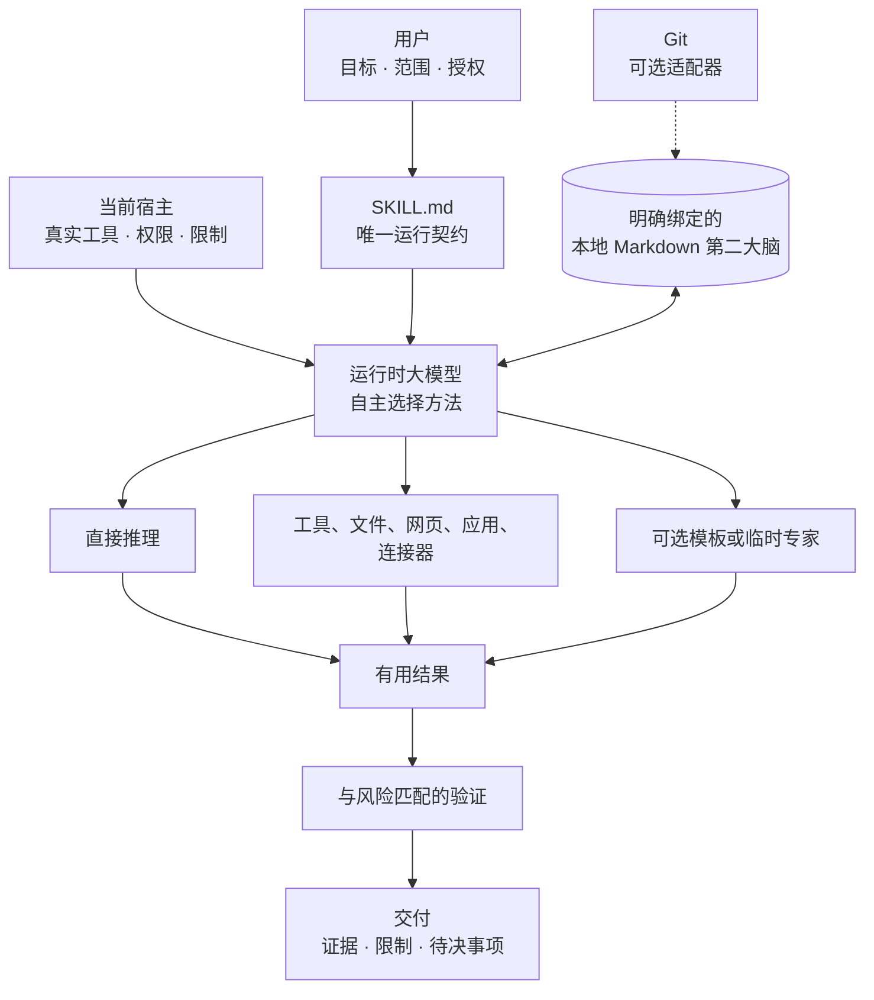

# Life OS

### 由大模型自主选择方法、以用户自有 Markdown 保存记忆的个人操作系统

[English](../../README.md) · [中文](README.md) · [日本語](../ja/README.md)

> **Life OS 给大模型的是“如何工作”的自主权，不是“可以做什么”的无限授权。**

Life OS 是一套可移植的 Markdown 运行契约，用来支持 AI 协助下的决策、规划、
复盘、研究、执行和长期个人知识管理。用户决定目标、范围、数据边界和重要外部
操作；运行时大模型根据真实任务选择最有用的方法。

这个方法可以是直接回答、提出少量关键问题、处理文件、浏览研究、使用应用或
连接器、调用一个专业视角、组合多个独立视角，也可以完全不使用工具。需要持久
上下文时，Life OS 使用一个由用户明确选定的本地 Markdown 目录。Git 不是必需
条件。

仓库根目录的 [`SKILL.md`](../../SKILL.md) 是**唯一的通用运行时权威**。
README 负责解释产品，不会额外创建另一套运行规则。

[为什么使用 Life OS？](#why-life-os) ·
[如何运作](#how-life-os-works) ·
[全部机制](#mechanisms-and-why-they-exist) ·
[使用场景](#what-you-can-use-it-for) ·
[Agent 模板](#the-24-optional-agent-templates) ·
[开始使用](#get-started)

## 一分钟了解 Life OS

1. **你说明结果和边界。** 说清楚想完成什么、哪些资料在范围内，以及哪些外部
   操作已授权或未授权。
2. **`SKILL.md` 提供产品契约。** 它定义权威、持久化、隐私、风险和完成语义。
3. **大模型选择方法。** 它可以直接完成、使用现有工具，或在确有价值时引入
   可选专业视角。
4. **持久记忆必须明确绑定。** 完整模式使用你亲自选定的本地 Markdown 目录；
   没有目录时，Life OS 仍可在仅对话模式中工作。
5. **证据强度与声明匹配。** 一段简单说明与数据迁移、公开发布、财务建议或
   正式 release 所需的验证强度不同。
6. **控制权始终属于你。** 本地保存不会自动变成 commit、push、发布、发送、
   删除、购买或迁移。

## 为什么需要 Life OS？

一个 AI 助手即使能力很强，也可能随着时间推移变得越来越不好用。问题往往不在
模型智力，而在于用户、大模型、个人知识和能够改变现实的工具之间，缺少一套
持久、透明、可理解的合作关系。

| 常见问题 | Life OS 的回应 | 为什么重要 |
|---|---|---|
| 每次对话都从零开始 | 明确绑定的本地 Markdown 第二大脑可以保留相关决策、项目、知识和上下文 | 工作可以跨会话积累，而不必把某个聊天记录当作唯一事实来源 |
| 框架强迫所有请求走同一条 agent 流程 | 运行时大模型按任务选择零个、一个或多个视角 | 简单工作保持简单，困难工作仍能获得真正的专业分工 |
| “记忆”被藏在供应商或数据库里 | Life OS 的持久知识是用户拥有、可读可改的 Markdown | 数据离开某个模型或应用后仍然有用 |
| 工具访问能力被误当成操作授权 | 工作范围和重要外部动作仍由用户决定 | 大模型可以果断工作，但不能凭空扩张权限 |
| “完成”只是大模型说完成了 | 验证强度随风险变化，并要求可观察证据 | 完成声明更可信 |
| 产品只能在一个 AI 宿主里运行 | 宿主适配器描述真实能力和诚实降级，不改变产品语义 | 同一份核心契约可在不同宿主之间迁移 |
| 个人系统逐渐变成流程官僚制 | 命令、阶段、agent 和 schema 都只是可选方法，不是固定仪式 | 结构服务于结果，而不是取代结果 |

如果你希望 AI 随着时间更理解你的上下文，但不想交出数据所有权；或者希望强大
模型能真正发挥判断力，又不被预设流程束缚，Life OS 尤其适合。

## Life OS 是什么，不是什么

| Life OS 是 | Life OS 不是 |
|---|---|
| 一套可移植的 Markdown 指令、模板、参考资料和一致性场景 | 一个新的基础大模型 |
| 让大模型在用户边界内自主选择方法的契约 | 不受限制的自治授权 |
| 使用本地 Markdown 保存长期个人上下文的方法 | 强制数据库、云账户或专有知识库 |
| 与宿主无关的产品层 | 保证所有宿主都提供同样的工具 |
| 一组可选分析视角 | 必须模拟的政府、公司或固定多 agent 组织 |
| 基于证据判断完成状态的框架 | AI 输出必然正确的保证 |
| 同时支持持久模式和仅对话模式 | 医疗、法律、财务或其他专业人士的替代品 |

Life OS 不要求你接受指定目录树、记住斜杠命令、安装 agent wrapper、运行 daemon、
启用 CI 或使用 Git。某个宿主可以提供这些能力，大模型也可以在有帮助时使用，
但它们都不是普通 Life OS 运行的隐藏前提。

## 七项设计承诺

1. **用户掌握目标和后果**
   用户拥有目标、范围、数据边界和重要外部操作的最终决定权。

2. **大模型掌握方法**
   大模型可按真实任务选择工具、上下文、拆分方式、专业视角、验证深度和呈现
   方式。

3. **只有一个通用运行时权威**
   `SKILL.md` 具有最终效力。宿主、模板、参考资料、文档和历史文件不能悄悄
   加入第二套强制流程。

4. **用户自有、Markdown 优先的持久化**
   长期知识无需特定模型、数据库或云服务，也能被理解和编辑。

5. **明确绑定工作区**
   Life OS 不搜索、不猜测、也不擅自采用第二大脑。

6. **结构与验证都要适量**
   编排和证据的多少由任务决定，而不是由仪式决定。

7. **诚实适配宿主能力**
   缺少工具时应降级或说明限制，不能伪造成功或模拟不存在的保证。

## Life OS 如何运作

这张图只是帮助理解，不是固定流水线。简单请求可以从用户直接到答案；高影响
迁移则可能需要检查上下文、设计保全方案、执行多项验证，并明确报告残余风险。

### 一次典型互动

1. 大模型识别真实目标以及已经授权的范围。
2. 只有当歧义会实质改变结果、目标、成本或风险时才提问。
3. 选择足以完成任务的最小方法。
4. 只加载当前目标真正需要的上下文。
5. 在范围内行动，只使用宿主真实具备的能力。
6. 用足以支撑完成声明的强度进行验证。
7. 报告结果；只有在用户要求持久化且存在合适绑定时才写入。

不存在全局强制的步骤数量或顺序。结果与边界是必须的，路线不是。

### 自然语言就是操作界面

Life OS 根据当前目标和范围理解普通语言。这些词表达意图，不是写死的流程宏。

| 用户说什么 | 通常意味着什么 | 不意味着什么 |
|---|---|---|
| **开始 / start** | 理解目标；相关时使用已有明确绑定 | 强制简报、pull 或启动 agent |
| **审阅 / review** | 检查所指材料并给出基于证据的发现 | 固定审查委员会或评分 |
| **规划 / plan** | 只增加对目标有用的结构 | 强制项目系统或永久记录 |
| **记住 / 保存** | 在合适的可写绑定中保存所指内容 | commit、push、云同步或保存每个推断 |
| **更新 / update** | 修改已经识别的范围内产物 | 批量迁移或无关现代化 |
| **完成 / 结束** | 总结或停止 | 归档、commit、push、发布或删除 |
| **检查 Life OS** | 检查授权环境，分别报告目录类型、绑定、模式和 Git | 搜索其他目录或在没有修复请求时改动 |

旧命令和主题触发词仍可作为自然语言意图理解，但不会重新启用已经退役的固定
流水线。

## 大模型主权

“大模型主权”意味着信任大模型对**方法**进行判断。它不意味着大模型成为用户
目标、身份、文件、账户或人生决定的主人。

| 大模型可以决定 | 仍由用户或平台决定 |
|---|---|
| 直接回答还是读取更多上下文 | 想要什么结果 |
| 某种工具能否改善结果 | 哪个工作区和哪些数据在范围内 |
| 是否需要零个、一个或多个专业视角 | 是否允许访问敏感数据 |
| 工作应顺序还是并行进行 | 是否授权重要外部操作 |
| 对某项声明验证到什么深度 | 是否接受重要建议 |
| 如何组织和解释结果 | 平台权限和安全要求 |

### 动态编排

Life OS 要求大模型使用**能实质改善结果的最少编排**。

| 情况 | 合理做法可能是 |
|---|---|
| “改写这句话” | 直接回答，不用工具，不用 agent |
| “比较这两个计划” | 直接比较，或使用一个聚焦的规划视角 |
| “审计这个 release” | 检查仓库；必要时加入独立 reviewer 或 auditor |
| “在搬家与留下之间选择” | 多个真正不同的视角、可见假设和情景比较 |
| “迁移我的知识库” | 确认精确目标、预览、保全证据、范围内修改和事后验证 |

大模型可以复用 `agents/` 模板、组合模板或创建临时专家。不能因为存在同名文件就
自动调用 agent，也不能声称宿主并未提供的进程隔离。

## 运行模式与持久记忆

### 完整模式与仅对话模式

| | 完整模式 | 仅对话模式 |
|---|---|---|
| 本地 Markdown 第二大脑 | 明确绑定一个用户批准的目录 | 未绑定目录 |
| 读取持久上下文 | 可以，但必须在绑定和当前任务范围内 | 只使用对话中提供的上下文 |
| 写入长期记录 | 有写权限且请求授权时可以 | 不可以 |
| 声称跨会话持久化 | 由绑定的 Markdown 数据支持 | 不声称 |
| 是否需要 Git | 不需要 | 不需要 |
| 分析、规划和研究 | 可以 | 可以 |

仅对话模式不是安装失败，而是为不希望绑定本地数据的用户提供的诚实、非持久
工作方式。

### 什么才算有效绑定？

有效绑定要明确：

- 用户亲自选择的本地目录；
- 访问权限是只读还是可读写；
- 授权只在本次会话有效，还是由宿主按用户要求长期记住；
- 当前宿主确实能够访问这个目录。

Life OS 不会从 `.git`、熟悉的文件夹名、`SOUL.md`、文件系统位置、之前显示过的
窗口或开发仓库推断绑定。如果之前批准的目标不可用，大模型应报告事实，而不是
默默换一个目录。

### Markdown 第二大脑可以保存什么？

Life OS 适应用户已有结构。常见但非强制的概念包括：

| 记录类型 | 可以保存的内容 |
|---|---|
| 决策 | 结果、理由、假设、备选方案、重新开启条件 |
| 任务 | 状态、优先级、截止日期、负责人、关联项目 |
| 项目 | 期望结果、里程碑、约束和当前状态 |
| 领域 | 健康、财务、关系、学习等长期责任 |
| 日志与复盘 | 事件、反思、进展、挫折和经验 |
| Wiki 笔记 | 带来源和关联的可复用知识 |
| 身份与价值观 | 用户亲自表达的原则、边界和长期方向 |
| 方法 | 可复用的工作方式及其适用条件 |
| 战略关系 | 目标或项目之间的依赖和二阶影响 |

这些都是能力，不是强制 schema。已有第二大脑的组织方式优先。Life OS 只创建
请求结果真正需要的内容，不会默默规范化整个目录。

### 持久化循环

持久上下文与当前任务相关时，大模型可以：

1. 检索少量真正相关的记录；
2. 区分当前事实、过去解释和已被取代的决定；
3. 在当前任务中使用这些上下文；
4. 用户要求时保存或更新长期记录；
5. 保留已有结构和无关内容；
6. 报告精确写入与未解决冲突。

它不应把每次对话都变成永久记忆，不应在没有用户意图时保存敏感推断，也不应
因为“可能有用”就加载无关私人数据。

### Git 是适配器，不是记忆本身

Git 可以提供历史、diff、同步和恢复证据，但它与本地 Markdown 持久化相互独立。

| 本地请求 | 是否意味着 Git 操作？ |
|---|---|
| “记住这个决定” | 否 |
| “把计划保存在绑定项目中” | 否 |
| “结束会话” | 否 |
| “commit 这些明确的修改” | 是，只针对这次范围内 commit |
| “把当前分支 push 到 origin” | 是，只针对这次远程操作 |

没有 Git 的第二大脑也能使用完整模式。没有绑定过的 Git 仓库不是第二大脑。

### 并发工作、冲突与迁移

Life OS 不要求统一锁技术，但要求安全结果：

- 覆盖共享记录前先读取当前内容；
- 不能静默丢失并发工作；
- 正确结果清楚时合并冲突；
- 存在实质歧义时报告给用户，而不是猜测；
- 不把临时文件或冲突产物报告成已完成记录。

根据宿主和目标，大模型可以选择原子写入、文件元数据、compare-and-swap、Git
或其他现有方法。结构迁移是独立且明确的操作：确认精确目标、预览实质修改、
保留用户内容、选择有用的恢复证据并验证结果。Git 可以提供帮助，但不是必需。

## 全部机制，以及为什么存在

| 机制 | 做什么 | 为什么存在 |
|---|---|---|
| 唯一权威 | 让 `SKILL.md` 成为最终产品契约 | 防止宿主、模板、命令和历史文档相互漂移 |
| 基于意图的授权 | 清楚、范围明确的请求可直接授权正常工作 | 避免反复确认，同时保留用户控制 |
| 工作区边界 | 只检查和修改用户明确选择的范围 | 能读文件不等于获准检查一个人的全部数字生活 |
| 大模型主权 | 让大模型选择方法、工具、角色和深度 | 强模型应适应问题，而不是表演仪式 |
| 动态编排 | 按需要使用零个、一个或多个视角 | 独立思考只有在价值超过协调成本时才值得 |
| 开放角色 | 允许跳过、组合或替换已有模板 | 新问题不应被塞进封闭组织结构 |
| 自然语言运行 | 理解“规划、复盘、记住、结束”等普通表达 | 用户不应被迫记忆控制语法 |
| 明确绑定第二大脑 | 把持久化连接到一个获批本地 Markdown 目录 | 长期私人上下文需要清楚的所有权与隐私边界 |
| 仅对话降级 | 没有持久存储时仍能正常工作 | 不是每次对话都需要或应该形成记忆 |
| Markdown 优先知识 | 用可移植文本保存长期上下文 | 知识可以检查、编辑、链接，也不依赖单一工具 |
| 可选 Git 适配器 | 按请求增加历史和同步能力 | 版本控制有价值，但不应决定产品是否可用 |
| 上下文最小化 | 只加载当前目标相关内容 | 减少隐私暴露、干扰和无谓 token 消耗 |
| 风险敏感判断 | 高影响工作使用更强证据和谨慎程度 | 不同领域出错的代价差异巨大 |
| 动态验证 | 验证方式与声明和影响匹配 | 一行改动与公开 release 不应使用相同证据 |
| 宿主适配 | 使用宿主真实能力并诚实降级 | Shell、应用、连接器和子代理在不同环境中并不相同 |
| 可选主题 | 只改变表达，不改变语义 | 用户可以选择舒适的文化界面而不改变安全规则 |
| 完成标准 | 区分观察、修改、验证、不可用和受阻状态 | “完成”应描述现实，而不是信心或意图 |
| 历史边界 | 把旧设计保留在 `docs/history/` | 保留来路，同时不复活过时规则 |

## 可以用 Life OS 做什么

Life OS 不只用于“人生规划”。只要上下文、判断、行动或学习需要持续连接，它就
可以支持个人和专业工作。

| 使用场景 | Life OS 能提供什么 | 请求示例 |
|---|---|---|
| 重大决策 | 备选方案、假设、取舍、情景和可逆实验 | “比较留下、搬家和推迟六个月，指出哪些假设控制结论。” |
| 每周重点 | 少量高杠杆结果和现实下一步 | “帮我选出本周最重要的三个结果。” |
| 项目规划 | 依赖、里程碑、负责人、风险和完成证据 | “把目标变成计划，但不要加入无用的项目管理仪式。” |
| 研究 | 有来源的发现、矛盾、不确定性和综合结论 | “使用最新一手来源研究，并区分证据和推断。” |
| 写作与沟通 | 针对受众的结构、草稿、利益相关方影响和审阅 | “起草这份提案，再挑战一个怀疑者会质疑的主张。” |
| 复盘 | 在明确时间段或证据集内识别有依据的模式 | “审阅这四篇周记，只保留出现超过一次的模式。” |
| 知识提取 | 可复用概念、方法、摘要和关联笔记 | “从这些文档提取长期有用的知识，并建议哪些值得保存。” |
| 价值观对齐 | 与用户自述价值观比较，但不替用户定义身份 | “说明这个选项与我提供的价值观在哪些地方一致或冲突。” |
| 财务推理 | 假设、现金流、下行情景、流动性和敏感性 | “按基准和下行情景比较，不要把分析包装成持牌建议。” |
| 健康与韧性 | 容量、习惯、环境、不确定性和专业求助边界 | “帮我设计可持续的作息，并指出哪些问题需要专业意见。” |
| 监控 | 宿主支持时，在明确期限内复查可观察条件 | “监控这个 PR，等 checks 结束后报告终态。” |
| 完成审计 | 用文件、测试、远程状态等独立证据核对声明 | “确认 release 是否真的发布，而不只是本地创建了 tag。” |

如果表格、agent、文件或持久记录不会改善结果，大模型可以直接回答。

## 24 个可选 Agent 模板

[`agents/`](../../agents/) 中的文件是可复用视角，不是必须启动的员工，也不是
封闭注册表。所有模板都继承父模型的用户范围、隐私边界和完成标准。

### 方向与决策质量

| 模板 | 可以贡献什么 |
|---|---|
| **Router · 路由判断** | 请求存在实质歧义时，澄清真实目标并选择合适路径 |
| **Planner · 规划** | 依赖和顺序重要时，把目标变成可执行、可验证的计划 |
| **Reviewer · 审阅** | 挑战假设、无证据声明、越界和薄弱取舍 |
| **Council · 多方讨论** | 保留并比较真正冲突但都有依据的视角 |
| **Strategist · 战略** | 检查长期方向、选择权、路径依赖和二阶影响 |
| **Advisor · 顾问** | 把当前决策与有依据的长期模式和实际建议连接起来 |
| **Values Check · 价值观检查** | 与用户自述价值观和身份比较，但不替用户定义它们 |

### 六个生活与工作领域

| 模板 | 可以贡献什么 |
|---|---|
| **People · 人与关系** | 关系、利益相关方、沟通、动机、信任和边界 |
| **Finance · 财务** | 现金流、资产、假设、流动性、机会成本和下行风险 |
| **Growth · 成长** | 学习、技能、表达、反馈循环和长期积累 |
| **Execution · 执行** | 优先级、顺序、负责人、瓶颈、行动和完成 |
| **Governance · 治理** | 权利、规则、义务、授权、问责、隐私和控制 |
| **Infrastructure · 基础设施** | 健康、环境、工具、容量、可靠性、维护和恢复 |

### 上下文、知识与证据

| 模板 | 可以贡献什么 |
|---|---|
| **Hippocampus · 海马体** | 从明确绑定的第二大脑中检索少量相关历史记录 |
| **Concept Lookup · 概念查找** | 带来源和置信度地找到相关概念与关系 |
| **Knowledge Extractor · 知识提取** | 把来源材料转化为可复用、可追溯的知识 |
| **Context Arbitrator · 上下文仲裁** | 排序和综合独立信号，同时保留分歧 |
| **Auditor · 审计** | 用独立证据核对声明和修改 |
| **Narrator · 叙事整理** | 把已验证材料写成清晰报告、简报或记录 |

### 交付、复盘与持久化

| 模板 | 可以贡献什么 |
|---|---|
| **Dispatcher · 分派** | 把可安全拆分的工作变成目标和所有权明确的任务 |
| **Retrospective · 复盘** | 在定义明确的时间段或工作范围中提取有证据的经验 |
| **Monitor · 监控** | 使用宿主真实能力，在有限期间观察明确条件 |
| **Archiver · 归档** | 把用户要求保存的内容写入明确绑定且可写的第二大脑 |
| **Memory Keeper · 记忆维护** | 按请求修复链接、协调记录或预览范围内迁移 |

直接完成足够时，应跳过所有模板。狭窄的一次性需求通常更适合临时专家，而不是
新增永久模板。

## 九个可选展示主题

主题改变展示名、语言、语气和标题。它们不会创建真实官职、审批权、否决权、
强制阶段或不同的安全规则。

| 语言 | 主题 | 表达风格 |
|---|---|---|
| English | Roman Republic | 克制、庄重的古典公民语汇 |
| English | US Government | 简洁的公共政策简报语言 |
| English | C-Suite | 直接的现代商业语言 |
| 中文 | 三省六部 | 现代中文结合历史治理隐喻 |
| 中文 | 现代政府 | 简洁、有条理的政策语言 |
| 中文 | 公司部门 | 专业、直接、结果导向的职场语言 |
| 日本語 | 明治政府 | 明快な現代語と歴史的な語彙 |
| 日本語 | 霞が関 | 簡潔な政策ブリーフ調 |
| 日本語 | 企業 | 明確で簡潔なビジネス日本語 |

主题完全可选。没有选择时，大模型应直接用用户语言自然工作，而不是阻塞任务。

## 宿主适配

Life OS 当前提供 [Claude](../../hosts/CLAUDE.md)、
[Gemini](../../hosts/GEMINI.md) 和 [Codex](../../hosts/AGENTS.md) 三个
非权威适配器。它们描述可能的能力，而不是三个不同产品。

| 能力 | 宿主具备时 | 宿主不具备时 |
|---|---|---|
| 本地文件系统 | 读取或编辑授权的 Markdown | 使用对话中提供的上下文 |
| Shell 或 CLI | 在它是最佳范围内方法时使用 | 使用宿主原生替代方案，或不用它继续 |
| 浏览器或连接器 | 研究或操作已授权外部系统 | 说明限制，或使用用户提供的来源 |
| 子代理 | 在独立性有价值时分派可安全拆分的工作 | 当前大模型直接完成 |
| 定时或重复观察 | 监控有终止条件的任务 | 提供手动复查或说明不支持 |
| 宿主权限提示 | 尊重平台权限边界 | 不再叠加一套 Life OS 仪式 |

宿主不能假装拥有实际不存在的隔离、后台执行、工具证据或持久化能力。

## 授权、隐私与风险

### 基于意图的授权

Life OS 希望在不进行重复权限表演的情况下果断工作。

| 情况 | 预期行为 |
|---|---|
| 在选定范围内进行相关只读检查 | 直接进行 |
| 请求中明确包含可逆、范围内修改 | 直接进行 |
| 在可写绑定中明确要求保存或更新 | 执行范围内本地写入 |
| 对明确目标精确要求 commit、push、发布、发送、删除、购买或迁移 | 将该精确请求视为授权 |
| 目标、接收人、成本、数据边界或破坏性影响存在实质歧义 | 行动前询问 |
| 重要操作会扩大到请求之外 | 扩大范围前询问 |
| 用户只说“完成”“结束”或“退朝” | 总结或停止，不推断副作用 |

### 隐私与上下文最小化

- 读取足以支撑结果的上下文，而不是所有可访问文件。
- 尊重每个明确排除的路径、人物、项目和主题。
- 只向专业视角提供完成任务需要的上下文。
- 不能因为本地内容可读，就把它暴露给外部服务。
- 不在日志和外部产物中泄露秘密、凭据和敏感私人资料。
- 不默默保存对健康、身份、关系或行为模式的敏感推断。

Life OS 是 Markdown 指令包，不是 sandbox 或加密产品。真实数据暴露还取决于
所选宿主、模型供应商、工具、连接器和操作环境，用户应另行评估它们。

### 风险敏感判断

健康、心理健康、法律权利、财务、身体安全、儿童、隐私、凭据、公开主张、
发布、不可逆修改和重大成本都需要更谨慎。

根据真实风险，大模型可以寻求更新的一手证据、展示假设和不确定性、比较下行情景、
缩小建议范围、建议咨询专业人士，或因缺少授权而暂停。风险标签本身不会自动
触发固定 agent 流程。

## 验证与完成

Life OS 不规定一个全局验证器，而是要求证据足以支撑正在作出的精确声明。

| 工作 | 合理证据可能包括 |
|---|---|
| 解释 | 检查权威来源并说明不确定性 |
| 本地文档修改 | 查看 diff、检查链接、frontmatter 和空白 |
| 代码修改 | 与受影响行为匹配的聚焦测试、build 或静态检查 |
| 外部操作 | 操作后重新读取外部系统，确认状态确实变化 |
| 数据迁移 | 精确范围、预览、保全或恢复证据、冲突处理和事后检查 |
| Release | 当前分支与 commit、文档一致性、相关检查、远程 tag 和已发布 release 状态 |

重要完成报告应区分：

- 观察到什么；
- 修改了什么；
- 验证了什么；
- 什么没有验证；
- 什么仍受阻或不可用。

当声明涉及外部或重要状态时，生成的报告、看起来绿色的标签、本地 commit 或
大模型自己的信心都不够。

## 开始使用

### 1. 让 AI 宿主能够读取 `SKILL.md`

宿主可以把仓库注册为本地 skill、把 Markdown 包复制到自己的 skill 位置，或
直接在仓库 checkout 中读取根目录 `SKILL.md`。

产品不要求统一安装器。宿主注册只是安装机制，不是运行权威。

### 2. 检查当前模式

可以这样说：

> 检查当前工作区是否可以使用 Life OS。不要查看其他目录，也不要进行修复。

一个有用的回答会分别说明：

- 当前目录类型；
- Life OS skill 是否可用；
- 第二大脑是否已绑定；
- 当前是完整模式还是仅对话模式；
- Git 是否可用，但与 Life OS 模式分开报告。

这就是自然语言 **Doctor（健康检查）**能力。除非用户要求修复，否则它只读；
也不能为了寻找第二大脑而搜索无关目录。

### 3. 不使用持久记忆也能开始

> 帮我决定本周优先做什么。只问那些会实质改变建议的问题，只使用当前对话里的
> 上下文。

这不需要主题、命令、第二大脑、Git 仓库或 agent。

### 4. 需要持久化时启用完整模式

先亲自选择一个本地 Markdown 目录，再说：

> 把我选定的本地目录绑定为本次会话可读写的 Life OS 第二大脑。阅读我指定的
> 项目笔记，帮我决定下一步，并把最终决定保存在该项目旁边。

这会授权所描述的本地读写，不会授权 commit、push、发布或批量迁移。

### 更多有用请求

> 比较这三个选项。说明假设、下行情景，以及什么证据会改变建议。

> 检查这个项目，找出最小但杠杆最高的下一步。不要创建庞大规划流程。

> 从这些来源中提取可复用知识。保留来源，保存任何敏感内容前先询问。

> 审计这个任务是否真的完成。区分本地证据、远程状态和无法验证的部分。

> 按现有本地结构把这个决定保存在已绑定第二大脑中。不要使用 Git。

## 兼容与迁移

- v1.9 和 v1.10 的已有 Markdown 仍然可读。
- 现有目录名和 frontmatter 不需要自动规范化。
- 旧触发词仍可作为自然语言意图理解。
- 使用 Git 的第二大脑继续可用，但 Git 不再是前提。
- 退役命令和固定流程只在 `docs/history/` 中保留来路。
- 结构迁移必须有清楚请求、精确目标、预览、保全证据和事后验证。

请求结构迁移前请阅读 [`MIGRATION.md`](MIGRATION.md)。

## 仓库结构

| 路径 | 用途 |
|---|---|
| [`SKILL.md`](../../SKILL.md) | 唯一通用运行契约 |
| [`AGENTS.md`](../../AGENTS.md) | 本开发仓库的贡献者说明 |
| [`hosts/`](../../hosts/) | 非权威宿主能力适配器 |
| [`agents/`](../../agents/) | 24 个可选复用视角 |
| [`themes/`](../../themes/) | 9 个可选展示适配器 |
| [`references/`](../../references/) | 非权威数据形态和运行参考 |
| [`evals/`](../../evals/) | 可观察行为一致性场景 |
| [`docs/`](../../docs/) | 当前指南和文档 |
| [`docs/history/`](../../docs/history/) | 已取代架构和发布证据 |
| [`i18n/zh/`](.) | 当前中文入口文档 |
| [`i18n/ja/`](../ja/) | 当前日文入口文档 |

建议继续阅读：

- [文档索引](../../docs/index.md)
- [安装说明](../../docs/installation.md)
- [快速开始](../../docs/getting-started/quickstart.md)
- [首次会话](../../docs/getting-started/first-session.md)
- [第二大脑概念](../../docs/second-brain.md)
- [Agent 与宿主](../../docs/reference/agents-and-hosts.md)
- [意图与授权](../../docs/user-guide/making-decisions/intent-and-authorization.md)
- [v1.11 迁移说明](MIGRATION.md)
- [完整变更记录](../../CHANGELOG.md)

## 常见问题

### 必须使用 Git 吗？

不需要。Git 可以增加历史、比较、同步和恢复证据，但有效本地 Markdown 绑定不
依赖 Git。

### 必须有第二大脑吗？

只有需要长期持久化的完整模式才需要。分析、规划、研究和直接协助可以在仅对话
模式中进行。

### Life OS 会自动寻找或读取我的私人文件吗？

不会。第二大脑必须明确绑定。可访问文件、附近路径、Git 配置或此前屏幕上下文
都不构成授权。

### “记住这个”会授权写入吗？

如果已经绑定可写第二大脑且目标清楚，直接要求“记住、保存、追踪或更新”会授权
对应的范围内本地持久化，但不会授权远程同步。

### Life OS 总是使用多个 agent 吗？

不会。直接完成足够时应直接完成。只有独立性或专业化能实质改善结果时，多个
视角才有价值。

### 大模型可以使用 Shell、CLI、浏览器或应用吗？

可以，前提是当前宿主提供、它们确实有帮助，并且操作在授权范围内。没有任何
一种工具是全局必需的。

### 主题是不同的操作系统吗？

不是。主题只改变词汇和语气，不改变权威、持久化、安全或编排。

### 需要哪一种 AI 模型？

Life OS 与模型和宿主无关。更强模型和更丰富宿主工具可能更擅长复杂任务，但
产品契约不绑定某个供应商或模型 ID。

### Life OS 是自治系统吗？

它提供的是对**方法**的自主权，而不是对**授权**的自主权。大模型可以选择如何
完成用户目标，但不能擅自进行重要操作或访问无关数据。

### Markdown 是大模型唯一可以创建的东西吗？

不是。Life OS 自身以可移植 Markdown 分发，但用户项目需要时，大模型可以创建
代码、文档、图片或其他产物。只是可执行自动化不能成为普通 Life OS 运行的隐藏
前提。

### Life OS 能替代医生、律师、财务顾问或心理咨询师吗？

不能。它可以组织信息、揭示假设、比较方案并判断何时应寻找专业帮助，但不能
冒充专业或人类权威。

### 如何知道任务真的完成了？

要求与声明匹配的证据。重要工作应区分观察状态、实际修改、已做检查、不可用
检查和剩余决策。

## 版本与许可

本 README 描述 Life OS **v1.11.0**。

Life OS 使用 [Apache License 2.0](../../LICENSE)。发布历史见
[CHANGELOG](../../CHANGELOG.md)，已取代设计见
[`docs/history/`](../../docs/history/)。
