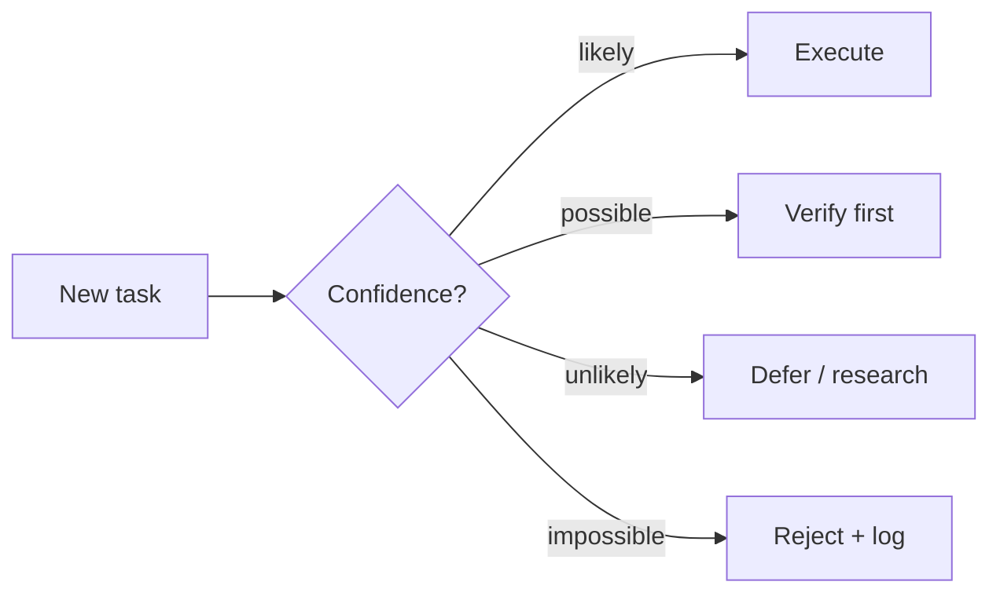

# Obsidian Readability Style Guide (v1.8.2 · canonical)

> **Why this exists**: Life OS's second-brain is markdown-only. Markdown
> opens in any editor, but the user's primary reader is Obsidian. This
> guide standardizes which Obsidian-native syntax features Life OS LLMs
> use when producing human-readable output, so the user's vault renders
> consistently and beautifully.
>
> **Scope**: ALL human-readable `.md` files Life OS writes — wiki entries,
> session archives, briefings, retrospective Mode 0 output, archiver
> Phase outputs, daily-briefing, wiki-decay reports, eval-history
> aggregates, compliance logs, method library, DREAM entries, SOUL
> snapshots — anything a human will read in Obsidian.
>
> **Out of scope**: pure data files (`.json`, `.yaml`, `.csv`, `.toml`),
> source code (`.sh`, `.py`, `.js`, `.ts`), agent definition files in
> `pro/agents/*.md` (those are LLM-system files, not user-facing reading
> material — though if heavily user-read, prefer to follow this guide too).

---

## HARD RULE summary (3 sentences)

1. **Use Obsidian callouts** (`> [!info]`, `> [!warning]`, etc.) for any
   semantic block (TL;DR, warnings, tips, questions, important notes) —
   NEVER plain headings for these.
2. **Use `[[wikilinks]]` for in-vault references**, standard markdown
   `[text](url)` only for external URLs.
3. **Use nested tags** (`fintech/stablecoin`), **mermaid blocks** for
   diagrams, **footnotes** `[^id]` for fine-grained citations.

If you violate any of these in a file inside the vault, you've shipped
a worse-rendering document than the user is paying you to write. Do it
right the first time.

---

## 1. Callouts (admonitions) — REQUIRED for semantic blocks

Obsidian renders callouts as styled boxes with icons. Plain markdown
renders as flat text. Always use callouts when a block has a clear
semantic role.

### Available types and intended use

| Callout | Use for | Example trigger |
|---|---|---|
| `> [!info]` | TL;DR, neutral summary, "what this is" | every report's leading paragraph |
| `> [!tip]` | When-to-use guidance, recommendations | method "When to use" sections |
| `> [!success]` | Confirmations, "done" notes, completion | adjourn checklists, verification passed |
| `> [!warning]` | Mandatory section reminders, must-check rules, side-effects | wiki Counterpoints, config side-effects |
| `> [!failure]` | Errors, things that didn't work | post-mortem failure modes |
| `> [!question]` | Open questions, unresolved gaps | wiki "Open questions" sections |
| `> [!important]` | Critical context, the decision/conclusion itself | decision rationale |
| `> [!quote]` | Imperative one-liner, lesson statement | lesson "one-line" sections |
| `> [!example]` | Concrete worked example | inline examples |
| `> [!note]` | Side-note, methodology footnote, glossary | provenance explanations |
| `> [!bug]` | Known issue, workaround | known limitations |
| `> [!danger]` | Irreversible action warning | destructive command callouts |

### Syntax

```markdown
> [!info] Optional title here
> Body text. Can span
> multiple lines.
>
> Can have multiple paragraphs inside.
>
> - Bulleted lists
> - Work fine
```

### Foldable callouts

Add `+` to default-open or `-` to default-fold:

```markdown
> [!info]+ Always-open callout
> ...

> [!info]- Default-folded callout
> ...
```

Use folding for long sections (e.g. detailed pros/cons tables) so the
overview stays readable.

### Anti-pattern

```markdown
## TL;DR
Short summary here.
```

Render: just a heading and a paragraph. Easy to skip.

```markdown
> [!info] TL;DR
> Short summary here.
```

Render: a styled box with an icon. Hard to miss.

---

## 2. Wikilinks vs markdown links

| When | Use | Example |
|---|---|---|
| Linking to another file in the vault | `[[wikilink]]` | `[[stablecoin-b2b]]` |
| Linking with custom display text | `[[wikilink\|label]]` | `[[stablecoin-b2b\|稳定币 B2B]]` |
| Linking to a section | `[[wikilink#Section]]` | `[[stablecoin-b2b#Mechanism]]` |
| Linking to a specific block | `[[wikilink#^block-id]]` | `[[stablecoin-b2b#^claim-1]]` |
| **Embedding** another file inline | `![[wikilink]]` | `![[transcript-2026-05-01]]` |
| Embedding an image stored in vault | `![[image.png]]` | `![[diagram.png]]` |
| External URL | `[text](https://...)` | `[Anthropic blog](https://...)` |

### Anti-pattern

```markdown
See [stablecoin background](../fintech/stablecoin-b2b.md) for context.
```

Renders, but Obsidian's graph view ignores this. Backlinks panel doesn't
populate. Auto-rename when you move the target file doesn't propagate.

```markdown
See [[stablecoin-b2b]] for context.
```

Native graph traversal. Backlinks update automatically. Rename-aware.

---

## 3. Nested tags (frontmatter)

```yaml
tags: [fintech/stablecoin, fintech/b2b, payments/cross-border]
```

Renders in Obsidian's tag pane as:

```
fintech/
├── stablecoin
└── b2b
payments/
└── cross-border
```

`#fintech/*` queries both `stablecoin` and `b2b` together. Flat tags
don't compose this way.

### Anti-pattern

```yaml
tags: [fintech, stablecoin, b2b, payments, cross-border]
```

Five flat tags with no relationship. Tag tree is a flat list of unrelated
items. Hard to navigate as the vault grows.

---

## 4. Mermaid diagrams (native rendering)

Obsidian renders ` ```mermaid ` blocks as live diagrams. Use when:

- A process / pipeline is naturally a flow (use `flowchart`)
- Relationships between entities are graph-shaped (use `graph` or `mindmap`)
- Sequence / interaction is what matters (use `sequenceDiagram`)
- A decision tree is being documented (use `flowchart` with diamond nodes)

### Example (decision tree)

````markdown

````

### When NOT to use mermaid

- The content is purely conceptual (no flow / no graph / no sequence)
- The diagram would just restate text in box form
- A simple bulleted list communicates the same thing more compactly

Don't force mermaid where prose or a list works better.

---

## 5. Footnotes (fine-grained citations)

```markdown
The OECD reports stablecoin transaction volume hit $X trillion in 2024[^oecd-24],
though the BIS contests the methodology[^bis-25].

[^oecd-24]: OECD (2024). *Title*. https://...
[^bis-25]: BIS (2025). *Title*. https://...
```

Obsidian renders footnotes with backlinks at the bottom. Useful when:

- A single paragraph has multiple distinct citations
- The citation source is too long to inline `[Title](URL)`
- You want the reader to focus on the claim, not the citation noise

For high-level "## Sources" lists at the bottom of an entry, use a regular
numbered list (not footnotes). Footnotes are for inline citations.

---

## 6. Frontmatter conventions

Every Obsidian-readable file should have YAML frontmatter when it's
content-bearing (not pure log output). Standard fields:

```yaml
---
title: "Human-readable title"
aliases: []                    # alternative names — Obsidian links by alias
tags: [domain/sub-topic]       # nested-tag style
created: YYYY-MM-DD
last_updated: YYYY-MM-DD
cssclasses: []                 # optional Obsidian CSS classes
---
```

For wiki entries specifically, also add: `kind`, `last_tended`, `review_by`,
`confidence`, `status`, `sources`, `domain` (see `wiki/SCHEMA.md` or
v1.8.2 templates in `wiki/.templates/`).

For session archives, briefings, reports: include at minimum `title`,
`created`, `tags`, and any session-specific metadata.

---

## 7. Tables (markdown-native, but follow conventions)

| Convention | Why |
|---|---|
| Always include the header separator row (`\|---\|---\|`) | Obsidian's table renderer requires it; raw text doesn't |
| Align columns visually in source if possible | Easier to read in non-rendering editors |
| Use `\| --- :\|` for right-align, `\|:--- :\|` for center | Sparingly — most tables left-align fine |
| Don't put complex content inside cells (multi-line, nested lists) | Obsidian's renderer has limits; complex content → use a callout instead |
| Limit table width to ~120 chars | Wider tables get scroll bars; bad for export |

---

## 8. Heading hierarchy

- **H1** (`#`) — exactly once per file, matches frontmatter `title`
- **H2** (`##`) — section dividers (TL;DR, Key facts, Mechanism, etc.)
- **H3** (`###`) — sub-sections within an H2
- **H4+** — used sparingly; if you need H5/H6, the content is too nested

Obsidian's outline panel walks H1→H6. Skipping levels (H2 → H4) renders
but breaks the outline tree.

---

## 9. Block IDs (for stable references)

Add a block ID to a paragraph or list item for stable linking:

```markdown
The decision to delay was made on 2026-04-15 by the council. ^decision-2026-04-15

(Then elsewhere:)
This was previously addressed in [[stablecoin-b2b#^decision-2026-04-15]].
```

Block IDs are useful for citing specific paragraphs in long entries.
Don't add block IDs to every paragraph — only the ones you reference
elsewhere.

---

## 10. CSS classes (per-entry styling — advanced)

```yaml
cssclasses: [decision, important]
```

In `.obsidian/snippets/lifeos.css`:

```css
.decision { border-left: 4px solid var(--color-blue); }
.important { background: var(--color-yellow-rgb); }
```

Optional. Most files don't need this. Only worth it if you want lesson /
decision / config kinds to look visually distinct.

---

## 11. What NOT to do

| Anti-pattern | Why it's bad |
|---|---|
| `## ⚠️ Warning` heading instead of `> [!warning]` callout | Heading flat-renders; callout is visually distinct |
| `[link](path/to/file.md)` for in-vault links | Breaks graph view + backlinks panel |
| Flat tags `[fintech, stablecoin]` | No tag tree composition |
| HTML `<details>` for collapsible content | Use foldable callouts `> [!info]-` instead — better cross-renderer support |
| HTML `<br/>` for line breaks | Two trailing spaces or a blank line is markdown-native |
| ASCII-art diagrams | Use mermaid; ASCII breaks at small widths |
| Raw URLs without link wrap | Obsidian auto-links sometimes but not consistently |
| `**bold**` instead of callouts for "important" sections | Bold is for inline emphasis; callouts are for blocks |

---

## 12. Quick reference for LLMs writing files

When you're an LLM writing a file Life OS will save to the vault, follow
this checklist:

- [ ] First non-frontmatter content uses a `> [!info] TL;DR` callout if it's a summary, or `> [!important]` if it's a decision/conclusion
- [ ] Counterpoints / Warnings / Side-effects / Mandatory sections are in `> [!warning]` callouts
- [ ] Open questions / Gaps are in `> [!question]` callouts
- [ ] Lessons / Imperative one-liners are in `> [!quote]` callouts
- [ ] References to other vault entries use `[[wikilinks]]`, never `[text](path.md)`
- [ ] External URLs use standard `[text](https://...)` markdown
- [ ] Tags are nested (`domain/sub-topic`) not flat
- [ ] If a flow/process is naturally diagrammable, embed a mermaid block; otherwise stay in prose
- [ ] Inline citations use footnotes `[^id]`; bottom-of-file source lists use numbered lists
- [ ] Heading hierarchy is H1 once → H2 sections → H3 sub-sections, no skipping

If your output passes this checklist, the user opens it in Obsidian and
gets a properly-rendered, navigable, graph-aware document. If not, they
get a wall of flat text that looks identical to a `cat` dump.

---

## 13. Migration tooling

- **`/wiki-obsidian-upgrade`** (slash command, v1.8.2) — one-shot batch
  upgrade of legacy wiki entries to use callouts + wikilinks + nested
  tags + `kind` field. Idempotent, with proposal preview before any
  write. See `scripts/prompts/wiki-obsidian-upgrade.md`.

For non-wiki files (sessions, SOUL snapshots, DREAM entries, reports):
no batch upgrade tool. New writes follow this guide; legacy files stay
as-is until the user touches them.
